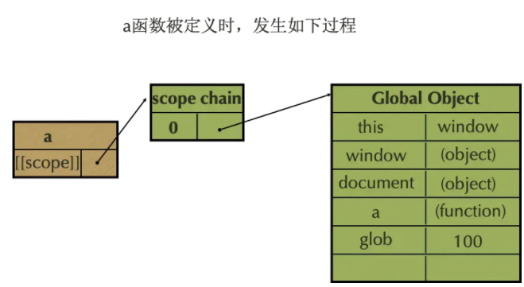
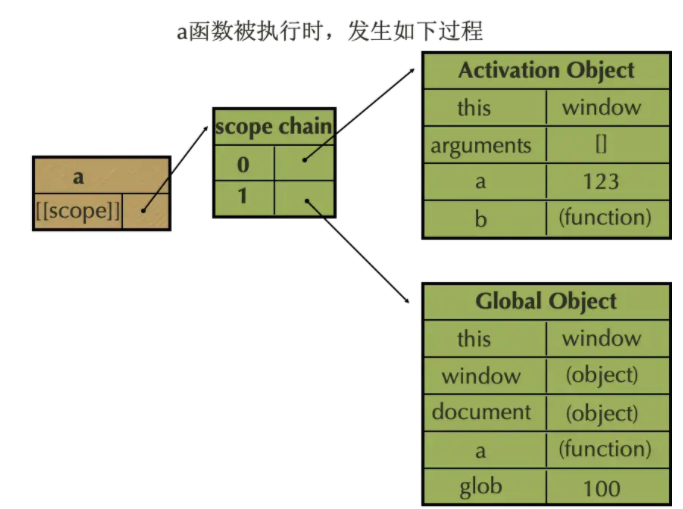
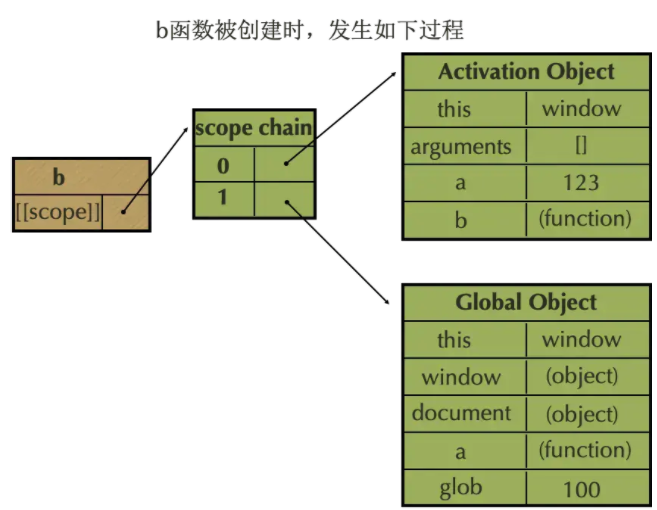
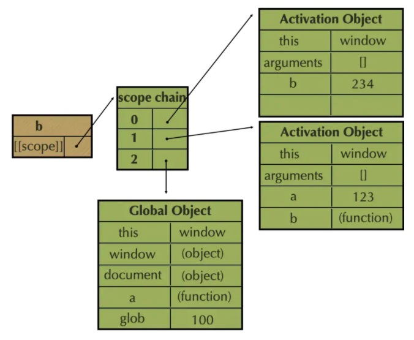

# JavaScript 的作用域链理解吗？

### 作用域

JavaScript 属于静态作用域，即声明的作用域是根据程序正文在编译时就确定的，有时也称为词法作用域。

#### 那么什么是作用域？

变量和函数能被有效访问的区域或者集合。作用域决定了代码块之间的资源可访问性。

作用域也就是一个独立的空间，用于保护变量防止泄露，也起到隔离作用。每个作用域里的变量可以相同命名，互不干涉。就像一栋房子一样，每家每户都是独立的，就是作用域。

作用域又分为全局作用域和函数作用域，块级作用域。 全局作用域任何地方都可以访问到，如 window,Math 等全局对象。 函数作用域就是函数内部的变量和方法，函数外部是无法访问到的。 块级作用域指变量声明的代码段外是不可访问的，如 let,const.

### 作用域链

什么是作用域链？
表示一个作用域可以访问到变量的一个集合。函数作为一个对象有一个[[scope]]属性，就是表示这个集合的。再来理解几个概念词：
AO:活动变量(Active object，VO)

VO:变量对象(Variable object，VO)

执行上下文：代码运行的环境，分为全局上下文和函数上下文。

其本质是 JavaScript 在执行过程中会创造可执行上下文，可执行上下文中的词法环境中含有外部词法环境的引用，我们可以通过这个引用获取外部词法环境的变量、声明等，这些引用串联起来一直指向全局的词法环境，因此形成了作用域链。

```JavaScript
function a() {
  function b() {
    var b = 234;
  }
  var a = 123;
  b();
}
var gloab = 100;
a();
```
第一步： a 函数定义

我们可以从上图中看到，a 函数在被定义时，a函数对象的属性[[scope]]作用域指向他的作用域链scope chain，此时它的作用域链的第一项指向了GO(Global Object)全局对象，我们看到全局对象上此时有5个属性，分别是this、window、document、a、glob。

第二步： a 函数执行

当a函数被执行时，此时a函数对象的作用域[[scope]]的作用域链scope chain的第一项指向了AO(Activation Object)活动对象，AO对象里有4个属性，分别是this、arguments、a、b。第二项指向了GO(Global Object)，GO对象里依然有5个属性，分别是this、window、document、a、golb。

第三步： b 函数定义

当b函数被定义时，此时b函数对象的作用域[[scope]]的作用域链scope chain的第一项指向了AO(Activation Object)活动对象，AO对象里有4个属性，分别是this、arguments、a、b。第二项指向了GO(Global Object)，GO对象里依然有5个属性，分别是this、window、document、a、golb。

第四步： b 函数执行

当b函数被执行时，此时b函数对象的作用域[[scope]]的作用域链scope chain的第一项指向了AO(Activation Object)活动对象，AO对象里有3个属性，分别是this、arguments、b。第一项指向了AO(Activation Object)活动对象，AO对象里有4个属性，分别是this、arguments、a、b。第二项指向了GO(Global Object)，GO对象里依然有5个属性，分别是this、window、document、a、golb。
以上就是上面代码执行完之后的结果。
