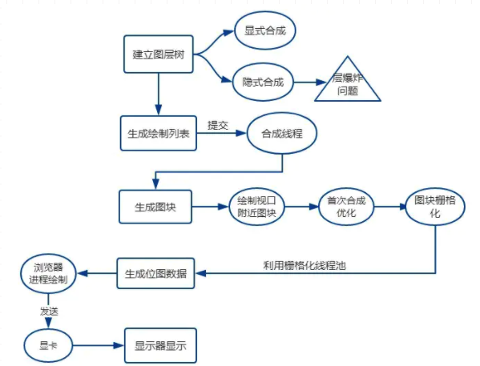

浏览器渲染机制
====
渲染机制分为如下阶段：
1. 构建DOM树
2. 样式计算
3. 布局阶段
4. 分层
5. 绘制
6. 分块
7. 光栅化
8. 合成

渲染模块把执行过程中化为很多的子阶段，渲染引擎从网络进程拿到字节流数据后，经过这些子阶段的处理，最后输出像素，这个过程可以称为渲染流水线 ，我们从一张图上来看👇

那接下来就从每个阶段来梳理一下大致过程。

## 构建DOM树
这个过程主要工作就是讲HTML内容转换为浏览器DOM树结构
 字节→字符→令牌→节点→对象模型(DOM)

```HTML
<html>
  <head>
    <meta name="viewport" content="width=device-width,initial-scale=1">
    <link href="style.css" rel="stylesheet">
    <title>Critical Path</title>
  </head>
  <body>
    <p>Hello <span>web performance</span> students!</p>
    <div></div>
  </body>
</html>
```

我们先看看数据是怎么样转换的👇


大概过程：
1. 转换：浏览器从磁盘或网络读取 HTML 的原始字节，并根据文件的指定编码（例如 UTF-8）将它们转换成各个字符。
2. 令牌化：浏览器将字符串转换成 W3C HTML5 标准规定的各种令牌，例如，“”、“”，以及其他尖括号内的字符串。每个令牌都具有特殊含义和一组规则。
3. 词法分析:发出的令牌转换成定义其属性和规则的“对象”。
4. DOM构建:**最后，由于 HTML 标记定义不同标记之间的关系（一些标记包含在其他标记内），创建的对象链接在一个树数据结构内，此结构也会捕获原始标记中定义的父项-子项关系：HTML 对象是 body 对象的父项，body 是 paragraph 对象的父项，依此类推。

我们把上述这样子的过程就叫做是构建DOM树过程

## 样式计算

这个子阶段主要有三个步骤:
* 格式化样式表
* 标准化样式表
* 计算每个DOM节点具体样式

#### 格式化样式表
我们拿到的也就是0，1字节流数据，浏览器无法直接去识别的，所以渲染引擎收到CSS文本数据后，会执行一个操作，转换为浏览器可以理解的结构-styleSheets
如果你很想了解这个格式化的过程，可以好好去研究下，不同的浏览器可能在CSS格式化过程中会有所不同，在这里就不展开篇幅了。
通过浏览器的控制台document.styleSheets可以来查看这个最终结果。通过JavaScript可以完成查询和修改功能,或者说这个阶段为后面的样式操作提供基石。
#### 标准化样式表
什么是标准化样式表呢?先看一段CSS文本👇
```CSS
body { font-size: 2em }
p {color:blue;}
span  {display: none}
div {font-weight: bold}
div  p {color:green;}
div {color:red; }
```

有些时候，我们写CSS 样式的时候，会写font-size:2em;color:red;font-weight:bold,像这些数值并不容易被渲染引擎所理解，因此需要在计算样式之前将它们标准化，如em->px,red->rgba(255,0,0,0),bold->700等等。

上面的代码标准后属性值是什么样子呢👇


#### 计算每个DOM节点具体样式

通过格式化和标准化，接下来就是计算每个节点具体样式信息了。
计算规则：继承和层叠
继承：每个子节点会默认去继承父节点的样式，如果父节点中找不到，就会采用浏览器默认的样式，也叫UserAgent样式。
层叠：样式层叠，是CSS一个基本特征，它定义如何合并来自多个源的属性值的算法。某种意义上，它处于核心地位，具体的层叠规则属于深入 CSS 语言的范畴，这里就补展开篇幅说了。
不过值得注意的是，在计算完样式之后，所有的样式值会被挂在到window.getComputedStyle当中，也就是可以通过JS来获取计算后的样式，非常方便。
这个阶段，完成了DOM节点中每个元素的具体样式，计算过程中要遵循CSS的继承和层叠两条规则，最终输出的内容是每个节点DOM的样式，被保存在ComputedStyle中。
想了解每个 DOM 元素最终的计算样式，可以打开 Chrome 的“开发者工具”，选择第一个“element”标签，比如我下面就选择了div标签，然后再选择“Computed”子标签

####另外一种说法CSSOM
如果不是很理解的话，可以看这里👇

跟处理HTML一样，我们需要更具CSS两个规则：继承和层叠转换成某种浏览器能理解和处理的东西，处理过程类似处理HTML，如上图☝
CSS 字节转换成字符，接着转换成令牌和节点，最后链接到一个称为“CSS 对象模型”(CSSOM) 的树结构内👇


很多人肯定看这个很熟悉，确实，很多博客都是基于CSSOM说法来讲的，我要说的是：
和DOM不一样，源码中并没有CSSOM这个词，所以很多文章说的CSSOM应该就是styleSheets，当然了这个styleSheets我们可以打印出来的
很多文章说法是渲染树也是16年前的说法，现在代码重构了，我们可以把LayoutTree看成是渲染树，不过它们之间还是有些区别的。

## 生成布局树
上述过程已经完成DOM树（DOM树）构建，以及样式计算（DOM样式），接下来就是要通过浏览器的布局系统确定元素位置，也就是生成一颗布局树（Layout Tree）,之前说法叫 渲染树。
#### 创建布局树

1. 在DOM树上不可见的元素，head元素，meta元素等，以及使用display:none属性的元素，最后都不会出现在布局树上，所以浏览器布局系统需要额外去构建一棵只包含可见元素布局树。
2. 我们直接结合图来看看这个布局树构建过程：


为了构建布局树，浏览器布局系统大体上完成了下面这些工作：
* 遍历DOM树可见节点，并把这些节点加到布局树中
* 对于不可见的节点，head,meta标签等都会被忽略。对于body.p.span 这个元素，它的属性包含display:none,所以这个元素没有被包含进布局树。
#### 布局计算
接下来就是要计算布局树节点的坐标位置，布局的计算过程非常复杂，张开介绍的话，会显得文章过于臃肿，大多数情况下，我们只需要知道它所做的工作是什么，想知道它是如何做的话，可以看看以下两篇文章👇
* [从Chrome源码看浏览器如何layout布局](https://zhuanlan.zhihu.com/p/25445527?refer=dreawer)
* [人人FED团队的文章-从Chrome源码看浏览器如何layout布局](https://www.rrfed.com/2017/02/26/chrome-layout/)

## 梳理前三个阶段
一图概括上面三个阶段:

## 分层
* 生成图层树（Layer Tree）
* 拥有层叠上下文属性的元素会被提升为单独一层
* 需要裁剪（clip）的地方也会创建图层
* 图层绘制

首先需要知道的就是，浏览器在构建完布局树后，还需要进行一系列操作，这样子可能考虑到一些复杂的场景，比如一些些复杂的 3D 变换、页面滚动，或者使用 z-indexing 做 z 轴排序等，还有比如是含有层叠上下文如何控制显示和隐藏等情况。

#### 生成图层树
你最终看到的页面，就是由这些图层一起叠加构成的，它们按照一定的顺序叠加在一起，就形成了最终的页面。

浏览器的页面实际上被分成了很多图层，这些图层叠加后合成了最终的页面。

我们来看看图层与布局树之间关系，如下图👇

通常情况下，并不是布局树的每个节点都包含一个图层，如果一个节点没有对应的层，那么这个节点就从属于父节点的图层。
那什么情况下，渲染引擎会为特定的节点创建新图层呢？
有两种情况需要分别讨论，一种是显式合成，一种是隐式合成。

#### 显式合成
一、 拥有层叠上下文的节点。
层叠上下文也基本上是有一些特定的CSS属性创建的，一般有以下情况:
1. HTML根元素本身就具有层叠上下文。
2. 普通元素设置position不为static并且设置了z-index属性，会产生层叠上下文
3. 元素的 opacity 值不是 1
4. 元素的 transform 值不是 none
5. 元素的 filter 值不是 none
6. 元素的 isolation 值是isolate
7. will-change指定的属性值为上面任意一个。(will-change的作用后面会详细介绍)

二、需要剪裁(clip)的地方。
比如一个标签很小，50*50像素，你在里面放了非常多的文字，那么超出的文字部分就需要被剪裁。当然如果出现了滚动条，那么滚动条也会被单独提升为一个图层，如下图


数字1箭头指向的地方，可以看看，可能效果不是很明显，大家可以自己打开这个Layers探索下。

元素有了层叠上下文的属性或者需要被剪裁，满足其中任意一点，就会被提升成为单独一层。

#### 隐式合成
这是一种什么样的情况呢，通俗意义上来说，就是z-index比较低的节点会提升为一个单独的途图层，那么层叠等级比它高的节点都会成为一个独立的图层。
[浏览器渲染流程&Composite（渲染层合并）简单总结](https://segmentfault.com/a/1190000014520786)
缺点： 根据上面的文章来说，在一个大型的项目中，一个z-index比较低的节点被提升为单独图层后，层叠在它上面的元素统统都会提升为单独的图层，我们知道，上千个图层，会增大内存的压力，有时候会让页面崩溃。这就是层爆炸

## 绘制
完成了图层的构建，接下来要做的工作就是图层的绘制了。图层的绘制跟我们日常的绘制一样，每次都会把一个复杂的图层拆分为很小的绘制指令，然后再按照这些指令的顺序组成一个绘制列表，类似于下图👇

大家可以在 Chrome 开发者工具中在设置栏中展开 more tools, 然后选择Layers面板，就能看到下面的绘制列表:


在该图中，**箭头2指向的区域 **就是 document 的绘制列表，**箭头3指向的拖动区域 **中的进度条可以重现列表的绘制过程。

当然了，绘制图层的操作在渲染进程中有着专门的线程，这个线程叫做合成线程。

## 分块
接下来我们就要开始绘制操作了，实际上在渲染进程中绘制操作是由专门的线程来完成的，这个线程叫合成线程。
绘制列表准备好了之后，渲染进程的主线程会给合成线程发送commit消息，把绘制列表提交给合成线程。接下来就是合成线程一展宏图的时候啦。

<pre>
  <code>
    有时候，你的图层很大，或者说你的页面需要使用滚动条，然后页面的内容太多，多的无法想象，
    这个时候需要滚动好久才能滚动到底部，但是通过视口，用户只能看到页面的很小一部分，所以在
    这种情况下，要绘制出所有图层内容的话，就会产生太大的开销，而且也没有必要。
  </code>
</pre>
基于上面的原因，合成线程会讲图层划分为图块(tile)

这些块的大小一般不会特别大，通常是 256 * 256 或者 512 * 512 这个规格。这样可以大大加速页面的首屏展示。
首屏渲染加速可以这么理解：
<pre>
  <code>
    因为后面图块（非视口内的图块）数据要进入 GPU 内存，考虑到浏览器内存上传到 GPU 内存的
    操作比较慢，即使是绘制一部分图块，也可能会耗费大量时间。针对这个问题，Chrome 采用了一
    个策略: 在首次合成图块时只采用一个低分辨率的图片，这样首屏展示的时候只是展示出低分辨率
    的图片，这个时候继续进行合成操作，当正常的图块内容绘制完毕后，会将当前低分辨率的图块内
    容替换。这也是 Chrome 底层优化首屏加载速度的一个手段。
  </code>
</pre>

## 光栅化

接着上面的步骤，有了图块之后，合成线程会按照视口附近的图块来优先生成位图，实际生成位图的操作是由栅格化来执行的。所谓栅格化，是指将图块转换为位图。
* 图块是栅格化执行的最小单位
* 渲染进程中专门维护了一个栅格化线程池，专门负责把图块转换为位图数据
* 合成线程会选择视口附近的图块(tile)，把它交给栅格化线程池生成位图
* 生成位图的过程实际上都会使用 GPU 进行加速，生成的位图最后发送给合成线程

运行方式如下👇


通常，栅格化过程都会使用 GPU 来加速生成，使用 GPU 生成位图的过程叫快速栅格化，或者 GPU 栅格化，生成的位图被保存在 GPU 内存中。
相信你还记得，GPU 操作是运行在 GPU 进程中，如果栅格化操作使用了 GPU，那么最终生成位图的操作是在 GPU 中完成的，这就涉及到了跨进程操作。具体形式你可以参考下图：


从图中可以看出，渲染进程把生成图块的指令发送给 GPU，然后在 GPU 中执行生成图块的位图，并保存在 GPU 的内存中。

## 合成和显示

栅格化操作完成后，合成线程会生成一个绘制命令，即"DrawQuad"，并发送给浏览器进程。
浏览器进程中的viz组件接收到这个命令，根据这个命令，把页面内容绘制到内存，也就是生成了页面，然后把这部分内存发送给显卡,那你肯定对显卡的原理很好奇。
看了某博主对显示器显示图像的原理解释:

<pre>
  <code>
    无论是 PC 显示器还是手机屏幕，都有一个固定的刷新频率，一般是 60 HZ，即 60 帧，也就是一秒更新 60 张图片，一张图片停留的时间约为 16.7 ms。而每次更新的图片都来自显卡的前缓冲区。而显卡接收到浏览器进程传来的页面后，会合成相应的图像，并将图像保存到后缓冲区，然后系统自动将前缓冲区和后缓冲区对换位置，如此循环更新。
  </code>
</pre>
这个时候，心中就有点概念了，比如某个动画大量占用内存时，浏览器生成图像的时候会变慢，图像传送给显卡就会不及时，而显示器还是以不变的频率刷新，因此会出现卡顿，也就是明显的掉帧现象。
用一张图来总结👇

我们把上面整个的渲染流水线，用一张图片更直观的表示👇


## 回流-重绘-合成

更新视图三种方式
* 回流
* 重绘
* 合成

#### 回流
另外一个叫法是重排，回流触发的条件就是:对 DOM 结构的修改引发 DOM 几何尺寸变化的时候,会发生回流过程。
具体一点，有以下的操作会触发回流:
1. 一个 DOM 元素的几何属性变化，常见的几何属性有width、height、padding、margin、left、top、border 等等, 这个很好理解。
2. 使 DOM 节点发生增减或者移动。
3. 读写 offset族、scroll族和client族属性的时候，浏览器为了获取这些值，需要进行回流操作。
4. 调用 window.getComputedStyle 方法。
一些常用且会导致回流的属性和方法：
* clientWidth、clientHeight、clientTop、clientLeft
* offsetWidth、offsetHeight、offsetTop、offsetLeft
* scrollWidth、scrollHeight、scrollTop、scrollLeft
* scrollIntoView()、scrollIntoViewIfNeeded()
* getComputedStyle()
* getBoundingClientRect()
* scrollTo()

依照上面的渲染流水线，触发回流的时候，如果 DOM 结构发生改变，则重新渲染 DOM 树，然后将后面的流程(包括主线程之外的任务)全部走一遍。


#### 重绘
当页面中元素样式的改变并不影响它在文档流中的位置时（例如：color、background-color、visibility等），浏览器会将新样式赋予给元素并重新绘制它，这个过程称为重绘。

根据概念，我们知道由于没有导致 DOM 几何属性的变化，因此元素的位置信息不需要更新，从而省去布局的过程，流程如下：

跳过了布局树和建图层树,直接去绘制列表，然后在去分块,生成位图等一系列操作。
可以看到，重绘不一定导致回流，但回流一定发生了重绘。
#### 合成
还有一种情况：就是更改了一个既不要布局也不要绘制的属性，那么渲染引擎会跳过布局和绘制，直接执行后续的合成操作，这个过程就叫合成。
举个例子：比如使用CSS的transform来实现动画效果，避免了回流跟重绘，直接在非主线程中执行合成动画操作。显然这样子的效率更高，毕竟这个是在非主线程上合成的，没有占用主线程资源，另外也避开了布局和绘制两个子阶段，所以相对于重绘和重排，合成能大大提升绘制效率。

利用这一点好处：
1. 合成层的位图，会交由 GPU 合成，比 CPU 处理要快
2. 当需要 repaint 时，只需要 repaint 本身，不会影响到其他的层
3. 对于 transform 和 opacity 效果，不会触发 layout 和 paint
提升合成层的最好方式是使用 CSS 的 will-change 属性

#### GPU加速原因
比如利用 CSS3 的transform、opacity、filter这些属性就可以实现合成的效果，也就是大家常说的GPU加速。
* 在合成的情况下，直接跳过布局和绘制流程，进入非主线程处理部分，即直接交给合成线程处理。
* 充分发挥GPU优势，合成线程生成位图的过程中会调用线程池，并在其中使用GPU进行加速生成，而GPU 是擅长处理位图数据的。
* 没有占用主线程的资源，即使主线程卡住了，效果依然流畅展示。

#### 实践意义
 *  使用createDocumentFragment进行批量的 DOM 操作
 *  对于 resize、scroll 等进行防抖/节流处理。
 *  动画使用transform或者opacity实现
 *  将元素的will-change 设置为 opacity、transform、top、left、bottom、right 。这样子渲染引擎会为其单独实现一个图层，当这些变换发生时，仅仅只是利用合成线程去处理这些变换，而不牵扯到主线程，大大提高渲染效率。
 *  对于不支持will-change 属性的浏览器，使用一个3D transform属性来强制提升为合成 transform: translateZ(0);
 *  rAF优化等等
