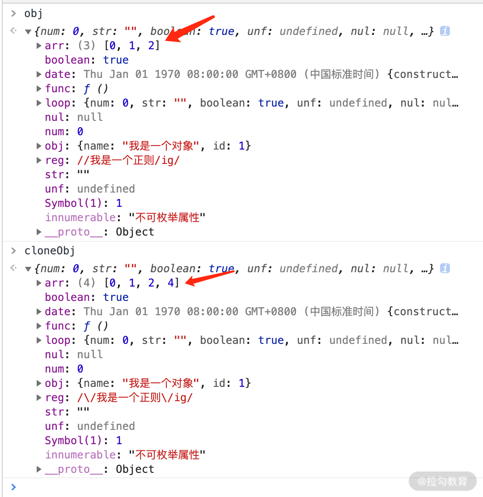

深拷贝
===
浅拷贝只是创建了一个新的对象，复制了原有对象的基本类型的值，而引用数据类型只拷贝了一层属性，再深层的还是无法进行拷贝。深拷贝则不同，对于复杂引用数据类型，其在堆内存中完全开辟了一块内存地址，并将原有的对象完全复制过来存放。

这两个对象是相互独立、不受影响的，彻底实现了内存上的分离。总的来说，深拷贝的原理可以总结如下：
> 将一个对象从内存中完整地拷贝出来一份给目标对象，并从堆内存中开辟一个全新的空间存放新对象，且新对象的修改并不会改变原对象，二者实现真正的分离。


### 方法一：简单版（JSON.stringify）

JSON.stringify() 是目前开发过程中最简单的深拷贝方法，其实就是把一个对象序列化成为 JSON 的字符串，并将对象里面的内容转换成字符串，最后再用 JSON.parse() 的方法将JSON 字符串生成一个新的对象。示例代码如下所示。

```JavaScript
const newObj = JSON.parse(JSON.stringify(oldObj));
```
但是使用 JSON.stringify 实现深拷贝还是有一些地方值得注意，主要有这几点
1. 拷贝的对象的值中如果有函数、undefined、symbol 这几种类型，经过 JSON.stringify 序列化之后的字符串中这个键值对会消失；
2. 拷贝 Date 引用类型会变成字符串；
3. 无法拷贝不可枚举的属性；
4. 无法拷贝对象的原型链；
5. 拷贝 RegExp 引用类型会变成空对象；
6. 对象中含有 NaN、Infinity 以及 -Infinity，JSON 序列化的结果会变成 null；
7. 无法拷贝对象的循环应用，即对象成环 (obj[key] = obj)。

针对这些存在的问题，你可以尝试着用下面的这段代码亲自执行一遍，来看看如此复杂的对象，如果用 JSON.stringify 实现深拷贝会出现什么情况。

```JavaScript
function Obj() { 

  this.func = function () { alert(1) }; 

  this.obj = {a:1};

  this.arr = [1,2,3];

  this.und = undefined; 

  this.reg = /123/; 

  this.date = new Date(0); 

  this.NaN = NaN;

  this.infinity = Infinity;

  this.sym = Symbol(1);

} 

let obj1 = new Obj();

Object.defineProperty(obj1,'innumerable',{ 

  enumerable:false,

  value:'innumerable'

});

console.log('obj1',obj1);

let str = JSON.stringify(obj1);

let obj2 = JSON.parse(str);

console.log('obj2',obj2);

```

通过上面这段代码可以看到执行结果如下图所示。


使用 JSON.stringify 方法实现深拷贝对象，虽然到目前为止还有很多无法实现的功能，但是这种方法足以满足日常的开发需求，并且是最简单和快捷的。而对于其他的也要实现深拷贝的，比较麻烦的属性对应的数据类型，JSON.stringify 暂时还是无法满足的，那么就需要下面的几种方法了。

#### 方法二：基础版（手写递归实现）

下面是一个实现 deepClone 函数封装的例子，通过 for in 遍历传入参数的属性值，如果值是引用类型则再次递归调用该函数，如果是基础数据类型就直接复制，代码如下所示。

```JavaScript
let obj1 = {
  a:{
    b:1
  }
}
function deepClone(obj) { 
  let cloneObj = {}
  for(let key in obj) {                 //遍历
    if(typeof obj[key] ==='object') { 
      cloneObj[key] = deepClone(obj[key])  //是对象就再次调用该函数递归
    } else {
      cloneObj[key] = obj[key]  //基本类型的话直接复制值
    }
  }
  return cloneObj
}
let obj2 = deepClone(obj1);
obj1.a.b = 2;
console.log(obj2);   //  {a:{b:1}}
```

虽然利用递归能实现一个深拷贝，但是同上面的 JSON.stringify 一样，还是有一些问题没有完全解决，例如：

1. 这个深拷贝函数并不能复制不可枚举的属性以及 Symbol 类型；
2. 这种方法只是针对普通的引用类型的值做递归复制，而对于 Array、Date、RegExp、Error、Function 这样的引用类型并不能正确地拷贝；
3. 对象的属性里面成环，即循环引用没有解决。

#### 方法三：改进版（改进后递归实现）

针对上面几个待解决问题，我先通过四点相关的理论告诉你分别应该怎么做。

1. 针对能够遍历对象的不可枚举属性以及 Symbol 类型，我们可以使用 Reflect.ownKeys 方法；
2. 当参数为 Date、RegExp 类型，则直接生成一个新的实例返回；
3. 利用 Object 的 getOwnPropertyDescriptors 方法可以获得对象的所有属性，以及对应的特性，顺便结合 Object 的 create 方法创建一个新对象，并继承传入原对象的原型链；
4. 利用 WeakMap 类型作为 Hash 表，因为 WeakMap 是弱引用类型，可以有效防止内存泄漏（你可以关注一下 Map 和 weakMap 的关键区别，这里要用 weakMap），作为检测循环引用很有帮助，如果存在循环，则引用直接返回 WeakMap 存储的值。

> 原生的 WeakMap 持有的是每个键对象的“弱引用”，这意味着在没有其他引用存在时垃圾回收能正确进行。原生 WeakMap 的结构是特殊且有效的，其用于映射的 key 只有在其没有被回收时才是有效的。
> 正由于这样的弱引用，WeakMap 的 key 是不可枚举的 (没有方法能给出所有的 key)。如果key 是可枚举的话，其列表将会受垃圾回收机制的影响，从而得到不确定的结果。

   
```JavaScript
const isComplexDataType = obj => (typeof obj === 'object' || typeof obj === 'function') && (obj !== null)
const deepClone = function (obj, hash = new WeakMap()) {
  if (obj.constructor === Date) 
  return new Date(obj)       // 日期对象直接返回一个新的日期对象
  if (obj.constructor === RegExp)
  return new RegExp(obj)     //正则对象直接返回一个新的正则对象
  //如果循环引用了就用 weakMap 来解决
  if (hash.has(obj)) return hash.get(obj)
  let allDesc = Object.getOwnPropertyDescriptors(obj)
  //遍历传入参数所有键的特性
  let cloneObj = Object.create(Object.getPrototypeOf(obj), allDesc)
  //继承原型链
  hash.set(obj, cloneObj)
  for (let key of Reflect.ownKeys(obj)) { 
    cloneObj[key] = (isComplexDataType(obj[key]) && typeof obj[key] !== 'function') ? deepClone(obj[key], hash) : obj[key]
  }
  return cloneObj
}
// 下面是验证代码
let obj = {
  num: 0,
  str: '',
  boolean: true,
  unf: undefined,
  nul: null,
  obj: { name: '我是一个对象', id: 1 },
  arr: [0, 1, 2],
  func: function () { console.log('我是一个函数') },
  date: new Date(0),
  reg: new RegExp('/我是一个正则/ig'),
  [Symbol('1')]: 1,
};
Object.defineProperty(obj, 'innumerable', {
  enumerable: false, value: '不可枚举属性' }
);
obj = Object.create(obj, Object.getOwnPropertyDescriptors(obj))
obj.loop = obj    // 设置loop成循环引用的属性
let cloneObj = deepClone(obj)
cloneObj.arr.push(4)
console.log('obj', obj)
console.log('cloneObj', cloneObj)
```

我们看一下结果，cloneObj 在 obj 的基础上进行了一次深拷贝，cloneObj 里的 arr 数组进行了修改，并未影响到 obj.arr 的变化，如下图所示。

