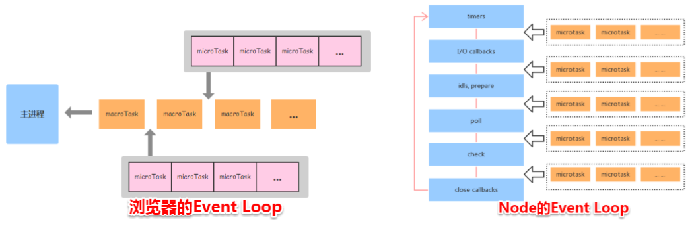

# 说一下事件循环机制(node、浏览器)

1.  为什么会有 Event Loop
    ​ JavaScript 的任务分为两种同步和异步，它们的处理方式也各自不同，同步任务是直接放在主线程上排队依次执行，异步任务会放在任务队列中，若有多个异步任务则需要在任务队列中排队等待，任务队列类似于缓冲区，任务下一步会被移到调用栈然后主线程执行调用栈的任务。

     <pre>
       <code>
         调用栈：调用栈是一个栈结构，函数调用会形成一个栈帧，帧中包含了当前执行函数的参数和局部变量等上下文信息，函数执行完后，它的执行上下文会从栈中弹出。
       </code>
     </pre>

    ​ JavaScript 是单线程的，单线程是指 js 引擎中解析和执行 js 代码的线程只有一个（主线程），每次只能做一件事情，然而 ajax 请求中，主线程在等待响应的过程中回去做其他事情，浏览器先在事件表注册 ajax 的回调函数，响应回来后回调函数被添加到任务队列中等待执行，不会造成线程阻塞，所以说 js 处理 ajax 请求的方式是异步的。

    ​ 综上所述，检查调用栈是否为空以及讲某个任务添加到调用栈中的个过程就是 event loop，这就是 JavaScript 实现异步的核心

2.  浏览器中的 Event Loop

    ##### Micro-Task 与 Macro-Task

    浏览器端事件循环中的异步队列有两种：macro（宏任务）队列和 micro（微任务）队列。
    常见的 macro-task：setTimeout、setInterval、script（整体代码）、 I/O 操作、UI 渲染等。
    常见的 micro-task: new Promise().then(回调)、MutationObserve 等。

    ##### requestAnimationFrame

    requestAnimationFrame 也属于异步执行的方法，但该方法既不属于宏任务，也不属于微任务。按照 MDN 中的定义：
    window.requestAnimationFrame() 告诉浏览器——你希望执行一个动画，并且要求浏览器在下次重绘之前调用指定的回调函数更新动画。该方法需要传入一个回调函数作为参数，该回调函数会在浏览器下一次重绘之前执行
    requestAnimationFrame 是 GUI 渲染之前执行，但在 Micro-Task 之后，不过 requestAnimationFrame 不一定会在当前帧必须执行，由浏览器根据当前的策略自行决定在哪一帧执行。

    event loop 过程
    

    1. 检查 macrotask 队列是否为空，非空则到 2，为空则到 3
    2. 执行 macrotask 中的一个任务
    3. 继续检查 microtask 队列是否为空，若有则到 4，否则到 5
    4. 取出 microtask 中的任务执行，执行完成返回到步骤 3
    5. 执行视图更新

       当某个宏任务执行完后,会查看是否有微任务队列。如果有，先执行微任务队列中的所有任务，如果没有，会读取宏任务队列中排在最前的任务，执行宏任务的过程中，遇到微任务，依次加入微任务队列。栈空后，再次读取微任务队列里的任务，依次类推。

3.  node 中的 Event Loop
    Node 中的 Event Loop 和浏览器中的是完全不相同的东西。Node.js 采用 V8 作为 js 的解析引擎，而 I/O 处理方面使用了自己设计的 libuv，libuv 是一个基于事件驱动的跨平台抽象层，封装了不同操作系统一些底层特性，对外提供统一的 API，事件循环机制也是它里面的实现
    
    根据上图 node 的运行机制如下

    1. V8 引擎解析 JavaScript 脚本。
    2. 解析后的代码，调用 Node API。
    3. libuv 库负责 Node API 的执行。它将不同的任务分配给不同的线程，形成一个 Event Loop（事件循环），以异步的方式将任务的执行结果返回给 V8 引擎。
    4. V8 引擎再将结果返回给用户。

    六大阶段:
    其中 libuv 引擎中的事件循环分为 6 个阶段，它们会按照顺序反复运行。每当进入某一个阶段的时候，都会从对应的回调队列中取出函数去执行。当队列为空或者执行的回调函数数量到达系统设定的阈值，就会进入下一阶段。

    1.  timers 阶段：这个阶段执行 timer（setTimeout、setInterval）的回调，并且是由 poll 阶段控制的。
    2.  I/O callbacks 阶段：处理一些上一轮循环中的少数未执行的 I/O 回调
    3.  idle, prepare 阶段：仅 node 内部使用
    4.  poll 阶段：获取新的 I/O 事件, 适当的条件下 node 将阻塞在这里
    5.  check 阶段：执行 setImmediate() 的回调
    6.  close callbacks 阶段：执行 socket 的 close 事件回调
        poll 阶段
        poll 是一个至关重要的阶段，这一阶段中，系统会做两件事情

        1.  回到 timer 阶段执行回调
        2.  执行 I/O 回调

        并且在进入该阶段时如果没有设定了 timer 的话，会发生以下两件事情

        - 如果 poll 队列不为空，会遍历回调队列并同步执行，直到队列为空或者达到系统限制
          _ 如果 poll 队列为空时，会有两件事发生
          _ 如果有 setImmediate 回调需要执行，poll 阶段会停止并且进入到 check 阶段执行回调 \* 如果没有 setImmediate 回调需要执行，会等待回调被加入到队列中并立即执行回调，这里同样会有个超时时间设置防止一直等待下去

          当然设定了 timer 的话且 poll 队列为空，则会判断是否有 timer 超时，如果有的话会回到 timer 阶段执行回调。

    ##### Micro-Task 与 Macro-Task

    Node 端事件循环中的异步队列也是这两种：macro（宏任务）队列和 micro（微任务）队列。

    - 常见的 macro-task 比如：setTimeout、setInterval、 setImmediate、script（整体代码）、 I/O 操作等。

    - 常见的 micro-task 比如: process.nextTick、new Promise().then(回调)等

      ##### setTimeout 和 setImmediate

    二者非常相似，区别主要在于调用时机不同。

    - setImmediate 设计在 poll 阶段完成时执行，即 check 阶段；
    - setTimeout 设计在 poll 阶段为空闲时，且设定时间到达后执行，但它在 timer 阶段执行

    ```Node
        setTimeout(function timeout () {
        console.log('timeout');
        },0);
        setImmediate(function immediate () {
        console.log('immediate');
        });
    ```

    1. 对于以上代码来说，setTimeout 可能执行在前，也可能执行在后。
    2. 首先 setTimeout(fn, 0) === setTimeout(fn, 1)，这是由源码决定的 进入事件循环也是需要成本的，如果在准备时候花费了大于 1ms 的时间，那么在 timer 阶段就会直接执行 setTimeout 回调
    3. 如果准备时间花费小于 1ms，那么就是 setImmediate 回调先执行了

    ##### process.nextTick

    这个函数其实是独立于 Event Loop 之外的，它有一个自己的队列，当每个阶段完成后，如果存在 nextTick 队列，就会清空队列中的所有回调函数，并且优先于其他 microtask 执行

4.  Node 与浏览器的 Event Loop 差异
    

- Node 端，microtask 在事件循环的各个阶段之间执行
- 浏览器端，microtask 在事件循环的 macrotask 执行完之后执行
