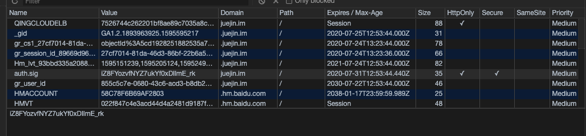

# 说一说你对 Cookie localStorage sessionStorage

## Cookie

HTTP 是一个无状态的协议，这里主要指的是 HTTP1.0 版本，简单的可以理解为即使同一个客户端连续两次发送请求给服务器，服务器也无法识别这个同一个客户端发的请求，导致的问题，比如现实生活中你加入一个商品到购物车，但是因为无法识别同一个客户端

为了解决 HTTP 无状态导致的问题（HTTP1.x），后来出现了 Cookie。

<pre><code>
  Cookie 的存在也不是为了解决通讯协议无状态的问题，只是为了解决客户端与服务端会话状态的问题，这个状态是指后端服务的状态而非通讯协议的状态。
</code></pre>

Cookie 存放在本地的好处就在于即使你关闭了浏览器，Cookie 依然可以生效。

#### Cookie 设置

怎么去设置呢？简单来说就是 👇

1. 客户端发送 HTTP 请求到服务器
2. 当服务器收到 HTTP 请求时，在响应头里面添加一个 Set-Cookie 字段
3. 浏览器收到响应后保存下 Cookie
4. 之后对该服务器每一次请求中都通过 Cookie 字段将 Cookie 信息发送给服务器。

#### Cookie 指令

在下面这张图里我们可以看到 Cookies 相关的一些属性

####「Name/Value」
用 JavaScript 操作 Cookie 的时候注意对 Value 进行编码处理。

#### Expires/Max-Age

Expires 用于设置 Cookie 的过期时间。比如：

<pre>
  <code>
  Set-Cookie: id=aad3fWa; Expires=Wed, 21 May 2020 07:28:00 GMT;
  </code>
</pre>

- 当 Expires 属性缺省时，表示是会话性 Cookie。
- 像上图 Expires 的值为 Session，表示的就是会话性 Cookie。
- 会话性 Cookie 的时候，值保存在客户端内存中，并在用户关闭浏览器时失效。
- 需要注意的是，有些浏览器提供了会话恢复功能，关闭浏览器，会话期 Cookie 会保留下来。
- 与会话性 Cookie 相对的是持久性 Cookie，持久性 Cookies 会保存在用户的硬盘中，直至过期或者清除 Cookie。
  Max-Age 用于设置在 Cookie 失效之前需要经过的秒数。比如：
    <pre>
    <code>
      Set-Cookie: id=a3fWa; Max-Age=604800;
    </code>
  </pre>
  假如 Expires 和 Max-Age 都存在，Max-Age 优先级更高。

#### Domain

Domain 指定了 Cookie 可以送达的主机名。假如没有指定，那么默认值为当前文档访问地址中的主机部分（但是不包含子域名）。

在这里注意的是，不能跨域设置 Cookie

#### Path

Path 指定了一个 URL 路径，这个路径必须出现在要请求的资源的路径中才可以发送 Cookie 首部。比如设置 Path=/docs，/docs/Web/ 下的资源会带 Cookie 首部，/test 则不会携带 Cookie 首部。
「Domain 和 Path 标识共同定义了 Cookie 的作用域：即 Cookie 应该发送给哪些 URL。」

#### Secure 属性

标记为 Secure 的 Cookie 只应通过被 HTTPS 协议加密过的请求发送给服务端。使用 HTTPS 安全协议，可以保护 Cookie 在浏览器和 Web 服务器间的传输过程中不被窃取和篡改。

#### HTTPOnly

设置 HTTPOnly 属性可以防止客户端脚本通过 document.cookie 等方式访问 Cookie，有助于避免 XSS 攻击。

#### SameSite

SameSite 属性可以让 Cookie 在跨站请求时不会被发送，从而可以阻止跨站请求伪造攻击（CSRF）。

这个属性值修改有什么影响呢？

从上图可以看出，对大部分 web 应用而言，Post 表单，iframe，AJAX，Image 这四种情况从以前的跨站会发送三方 Cookie，变成了不发送。

#### Cookie 的作用

Cookie 主要用于以下三个方面：

1. 会话状态管理（如用户登录状态、购物车、游戏分数或其它需要记录的信息）
2. 个性化设置（如用户自定义设置、主题等）
3. 浏览器行为跟踪（如跟踪分析用户行为等）

#### Cookie 的缺点

从大小，安全，增加请求大小。

- 容量缺陷。Cookie 的体积上限只有 4KB，只能用来存储少量的信息。
- 降低性能，Cookie 紧跟着域名，不管域名下的某个地址是否需要这个 Cookie，请求都会带上完整的 Cookie，请求数量增加，会造成巨大的浪费。
- 安全缺陷，Cookie 是以纯文本的形式在浏览器和服务器中传递，很容易被非法用户获取，当 HTTPOnly 为 false 时，Cookie 信息还可以直接通过 JS 脚本读取。

## localStorage 和 sessionStorage

在 web 本地存储场景上，cookie 的使用受到种种限制，最关键的就是存储容量太小和数据无法持久化存储。

在 HTML 5 的标准下，出现了 localStorage 和 sessionStorage 供我们使用。

#### 异同点

#### 操作方式

接下来我们来具体看看如何来操作 localStorage 和 sessionStorage

<pre>
  <code>
    let obj = { name: "TianTianUp", age: 18 };
    localStorage.setItem("name", "TianTianUp"); 
    localStorage.setItem("info", JSON.stringify(obj));
  </code>
</pre>

接着进入相同的域名时就能拿到相应的值 👇

<pre>
  <code>
    let name = localStorage.getItem("name");
    let info = JSON.parse(localStorage.getItem("info"));
  </code>
</pre>

从这里可以看出，localStorage 其实存储的都是字符串，如果是存储对象需要调用 JSON 的 stringify 方法，并且用 JSON.parse 来解析成对象。

#### 应用场景

- localStorage 适合持久化缓存数据，比如页面的默认偏好配置，如官网的 logo，存储 Base64 格式的图片资源等；
- sessionStorage 适合一次性临时数据保存，存储本次浏览信息记录，这样子页面关闭的话，就不需要这些记录了，还有对表单信息进行维护，这样子页面刷新的话，也不会让表单信息丢失。
