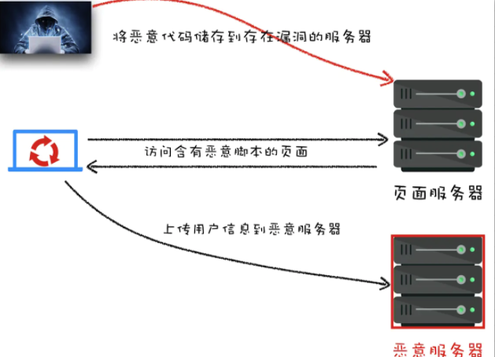

# 谈一谈你对 XSS 攻击理解

## 什么是 XSS 攻击

XSS 全称是 Cross Site Scripting ,为了与 CSS 区分开来，故简称 XSS，翻译过来就是“跨站脚本”。
XSS 是指黑客往 HTML 文件中或者 DOM 中注入恶意脚本，从而在用户浏览页面时利用注入的恶意脚本对用户实施攻击的一种手段。
最开始的时候，这种攻击是通过跨域来实现的，所以叫“跨域脚本”。发展到现在，往 HTML 文件中中插入恶意代码方式越来越多，所以是否跨域注入脚本已经不是唯一的注入手段了，但是 XSS 这个名字却一直保留至今。
注入恶意脚本可以完成这些事情：

1. 窃取 Cookie
2. 监听用户行为，比如输入账号密码后之间发给黑客服务器
3. 在网页中生成浮窗广告
4. 修改 DOM 伪造登入表单

一般的情况下，XSS 攻击有三种实现方式:

- 存储型 XSS 攻击
- 反射型 XSS 攻击
- 基于 DOM 的 XSS 攻击

#### 存储型 XSS 攻击

从图上看，存储型 XSS 攻击大致步骤如下：

1. 首先黑客利用站点漏洞将一段恶意 JavaScript 代码提交到网站的数据
2. 然后用户向网站请求包含了恶意 JavaScript 脚本的页面；
3. 当用户浏览该页面的时候，恶意脚本就会将用户的 Cookie 信息等数据上传到服务器。
   比如常见的场景：
   在评论区提交一份脚本代码，假设前后端没有做好转义工作，那内容上传到服务器，在页面渲染的时候就会直接执行，相当于执行一段未知的 JS 代码。这就是存储型 XSS 攻击。

#### 反射型 XSS 攻击

反射型 XSS 攻击指的就是恶意脚本作为「网络请求的一部分」，随后网站又把恶意的 JavaScript 脚本返回给用户，当恶意 JavaScript 脚本在用户页面中被执行时，黑客就可以利用该脚本做一些恶意操作。
举个例子:

<pre>
  <code>
    http://TianTianUp.com?query=
  </code>
</pre>

如上，服务器拿到后解析参数 query，最后将内容返回给浏览器，浏览器将这些内容作为 HTML 的一部分解析，发现是 Javascript 脚本，直接执行，这样子被 XSS 攻击了。

这也就是反射型名字的由来，将恶意脚本作为参数，通过网络请求，最后经过服务器，在反射到 HTML 文档中，执行解析。

主要注意的就是，「服务器不会存储这些恶意的脚本，这也算是和存储型 XSS 攻击的区别吧」。

#### 基于 DOM 的 XSS 攻击

基于 DOM 的 XSS 攻击是不牵涉到页面 Web 服务器的。具体来讲，黑客通过各种手段将恶意脚本注入用户的页面中，在数据传输的时候劫持网络数据包
常见的劫持手段有：

- WIFI 路由器劫持
- 本地恶意软件

## 阻止 XSS 攻击的策略

以上讲述的 XSS 攻击原理，都有一个共同点：让恶意脚本直接在浏览器执行。
针对三种不同形式的 XSS 攻击，有以下三种解决办法：

#### 对输入脚本进行过滤或转码

对用户输入的信息过滤或者是转码
举个例子 👇

<pre>
  <code>
    &lt;script&gt;alert(&#39;你受到XSS攻击了&#39;)&lt;/script&gt;
  </code>
</pre>

这样的代码在 html 解析的过程中是无法执行的。

#### 利用 CSP

该安全策略的实现基于一个称作 Content-Security-Policy 的 HTTP 首部。
CSP，即浏览器中的内容安全策略，它的核心思想大概就是服务器决定浏览器加载哪些资源，具体来说有几个功能 👇

- 限制加载其他域下的资源文件，这样即使黑客插入了一个 JavaScript 文件，这个 JavaScript 文件也是无法被加载的；
- 禁止向第三方域提交数据，这样用户数据也不会外泄；
- 提供上报机制，能帮助我们及时发现 XSS 攻击。
- 禁止执行内联脚本和未授权的脚本；

#### 利用 HttpOnly

由于很多 XSS 攻击都是来盗用 Cookie 的，因此还可以通过使用 HttpOnly 属性来保护我们 Cookie 的安全。这样子的话，JavaScript 便无法读取 Cookie 的值。这样也能很好的防范 XSS 攻击。
通常服务器可以将某些 Cookie 设置为 HttpOnly 标志，HttpOnly 是服务器通过 HTTP 响应头来设置的，下面是打开 Google 时，HTTP 响应头中的一段

<pre>
  <code>
    set-cookie: NID=189=M8l6-z41asXtm2uEwcOC5oh9djkffOMhWqQrlnCtOI; expires=Sat, 18-Apr-2020 06:52:22 GMT; path=/; domain=.google.com; HttpOnly
  </code>
</pre>

## 总结

XSS 攻击是指浏览器中执行恶意脚本, 然后拿到用户的信息进行操作。主要分为存储型、反射型和文档型。防范的措施包括:

- 对输入内容过滤或者转码，尤其是类似于<script>、、<a>标签
- 利用 CSP
- 利用 Cookie 的 HttpOnly 属性
  除了以上策略之外，我们还可以通过添加验证码防止脚本冒充用户提交危险操作。而对于一些不受信任的输入，还可以限制其输入长度，这样可以增大 XSS 攻击的难度。
