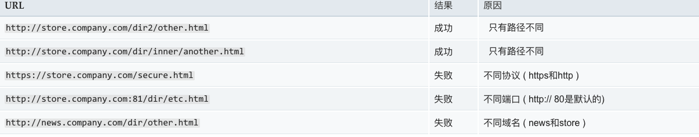

# 谈一谈跨域，同源策略，以及跨域解决方案

###什么是跨域

跨域，是指浏览器不能执行其他网站的脚本。它是由浏览器的同源策略造成的，是浏览器对 JavaScript 实施的安全限制。

###同源策略

同源策略是一个安全策略。所谓的同源,指的是协议,域名,端口相同。

浏览器处于安全方面的考虑,只允许本域名下的接口交互,不同源的客户端脚本,在没有明确授权的情况下,不能读写对方的资源。

限制了一下行为：

- Cookie、LocalStorage 和 IndexDB 无法读取
- DOM 和 JS 对象无法获取
- Ajax 请求发送不出去

### 解决方案

#### jsonp 跨域

利用 script 标签没有跨域限制的漏洞，网页可以拿到从其他来源产生动态 JSON 数据，当然了 JSONP 请求一定要对方的服务器做支持才可以。

###### 与 AJAX 对比

JSONP 和 AJAX 相同，都是客户端向服务器发送请求，从服务器获取数据的方式。但是 AJAX 属于同源策略，JSONP 属于非同源策略(跨域请求)

###### JSONP 优点

兼容性比较好，可用于解决主流浏览器的跨域数据访问的问题。缺点就是仅支持 get 请求，具有局限性，不安全，可能会受到 XSS 攻击。

###### 思路 👇

- 创建 script 标签
- 设置 script 标签的 src 属性，以问号传递参数，设置好回调函数 callback 名称
- 插入 html 文本中
- 调用回调函数，res 参数就是获取的数据

<pre>
  <code>
    let script = document.createElement('script');

    script.src = 'http://www.baidu.cn/login?username=TianTianUp&callback=callback';

    document.body.appendChild(script);

    function callback(res) {
      console.log(res);
    }

  </code>
</pre>

当然，jquery 也支持 jsonp 的实现方式

<pre>
  <code>
      $.ajax({
        url: 'http://www.baidu.cn/login',
        type: 'GET',
        dataType: 'jsonp', //请求方式为jsonp
        jsonpCallback: 'callback',
        data: {
          "username": "Nealyang"
        }
      })
  </code>
</pre>

###### JSONP 优点

- 它不像 XMLHttpRequest 对象实现的 Ajax 请求那样受到同源策略的限制
- 它的兼容性更好，在更加古老的浏览器中都可以运行，不需要 XMLHttpRequest 或 ActiveX 的支持
- 并且在请求完毕后可以通过调用 callback 的方式回传结果。

###### JSONP 缺点

- 它只支持 GET 请求而不支持 POST 等其它类型的 HTTP 请求
- 它只支持跨域 HTTP 请求这种情况，不能解决不同域的两个页面之间如何进行 JavaScript 调用的问题

#### 跨域资源共享 CORS

<pre>
  <code>
    CORS（Cross-Origin Resource Sharing）跨域资源共享，定义了必须在访问跨域资源时，
    浏览器与服务器应该如何沟通。CORS背后的基本思想就是使用自定义的HTTP头部让浏览器与服务
    器进行沟通，从而决定请求或响应是应该成功还是失败。目前，所有浏览器都支持该功能，IE浏览
    器不能低于IE10。整个CORS通信过程，都是浏览器自动完成，不需要用户参与。对于开发者来
    说，CORS通信与同源的AJAX通信没有差别，代码完全一样。浏览器一旦发现AJAX请求跨源，就会
    自动添加一些附加的头信息，有时还会多出一次附加的请求，但用户不会有感觉。
  </code>
</pre>

上面的引用，你要记住的关键点 👇 #####「CORS 需要浏览器和后端同时支持。IE 8 和 9 需要通过 XDomainRequest 来实现」。

- 「浏览器会自动进行 CORS 通信，实现 CORS 通信的关键是后端。只要后端实现了 CORS，就实现了跨域。」
- 服务端设置 Access-Control-Allow-Origin 就可以开启 CORS。 该属性表示哪些域名可以访问资源，如果设置通配符则表示所有网站都可以访问资源。

请求分为「简单请求」和「非简单请求」，所以我们的了解这两种情况。

###### 简单请求

满足下面两个条件，就属于简单请求 👇
条件 1：使用下列方法之一：

- GET
- HEAD
- POST
  条件 2：Content-Type 的值仅限于下列三者之一 👇
- text/plain
- multipart/form-data
- application/x-www-form-urlencoded

请求中的任意 XMLHttpRequestUpload 对象均没有注册任何事件监听器；
XMLHttpRequestUpload 对象可以使用 XMLHttpRequest.upload 属性访问。

###### 复杂请求

不符合以上条件的请求就肯定是复杂请求了。 复杂请求的 CORS 请求，会在正式通信之前，增加一次 HTTP 查询请求，称为"预检"请求,该请求是 option 方法的，通过该请求来知道服务端是否允许跨域请求。
直接上一个例子吧 👇 看看一个完整的复杂请求吧，并且介绍一下 CORS 请求的字段。

<pre>
  <code>
    //server2.js
    let express = require('express')
    let app = express()
    let whitList = ['http://localhost:3000'] //设置白名单
    app.use(function(req, res, next) {
      let origin = req.headers.origin
      if (whitList.includes(origin)) {
        // 设置哪个源可以访问我
        res.setHeader('Access-Control-Allow-Origin', origin)
        // 允许携带哪个头访问我
        res.setHeader('Access-Control-Allow-Headers', 'name')
        // 允许哪个方法访问我
        res.setHeader('Access-Control-Allow-Methods', 'PUT')
        // 允许携带cookie
        res.setHeader('Access-Control-Allow-Credentials', true)
        // 预检的存活时间
        res.setHeader('Access-Control-Max-Age', 6)
        // 允许返回的头
        res.setHeader('Access-Control-Expose-Headers', 'name')
        if (req.method === 'OPTIONS') {
          res.end() // OPTIONS请求不做任何处理
        }
      }
      next()
    })
    app.put('/getData', function(req, res) {
      console.log(req.headers)
      res.setHeader('name', 'jw') //返回一个响应头，后台需设置
      res.end('我不爱你')
    })
    app.get('/getData', function(req, res) {
      console.log(req.headers)
      res.end('我不爱你')
    })
    app.use(express.static(__dirname))
    app.listen(4000)
  </code>
</pre>

上述代码由http://localhost:3000/index.html向http://localhost:4000/跨域请求，正如我们上面所说的，后端是实现 CORS 通信的关键。

######与 JSONP 对比

- JSONP 只能实现 GET 请求，而 CORS 支持所有类型的 HTTP 请求。
- 使用 CORS，开发者可以使用普通的 XMLHttpRequest 发起请求和获得数据，比起 JSONP 有更好的错误处理。
- JSONP 主要被老的浏览器支持，它们往往不支持 CORS，而绝大多数现代浏览器都已经支持了 CORS）

#### WebSocket 协议跨域

Websocket 是 HTML5 的一个持久化的协议，它实现了浏览器与服务器的全双工通信，同时也是跨域的一种解决方案。

<pre>
  <code>
    WebSocket和HTTP都是应用层协议，都基于 TCP 协议。但是 「WebSocket 是一种双向通信
    协议，在建立连接之后，WebSocket 的 server 与 client 都能主动向对方发送或接收数
    据」。同时，WebSocket 在建立连接时需要借助 HTTP 协议，连接建立好了之后 client 与 
    server 之间的双向通信就与 HTTP 无关了。
  </code>
</pre>

我们先来看个例子 👇

本地文件 socket.html 向 localhost:3000 发生数据和接受数据 👇

<pre>
  <code>
    // socket.html
    let socket = new WebSocket('ws://localhost:3000');
    socket.onopen = function () {
      socket.send('我爱你');//向服务器发送数据
    }
    socket.onmessage = function (e) {
      console.log(e.data);//接收服务器返回的数据
    }
  </code>
</pre>

后端部分 👇

<pre>
<code></code>
  // server.js
  let WebSocket = require('ws'); //记得安装ws
  let wss = new WebSocket.Server({port:3000});
  wss.on('connection',function(ws) {
    ws.on('message', function (data) {
      console.log(data);
      ws.send('我不爱你')
    });
  })
</pre>

如果 你想去尝试的话，建议可以去玩一玩 Socket.io,

- 这是因为原生 WebSocket API 使用起来不太方便，它很好地封装了 webSocket 接口
- 提供了更简单、灵活的接口，也对不支持 webSocket 的浏览器提供了向下兼容。
