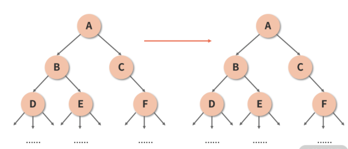
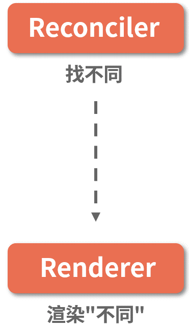
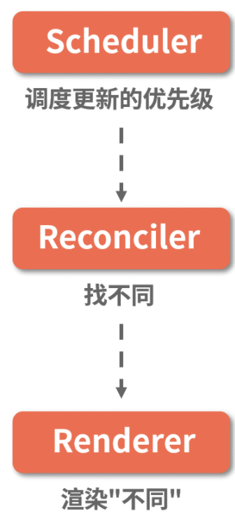
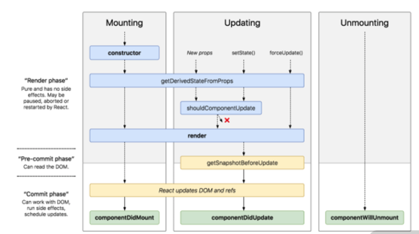
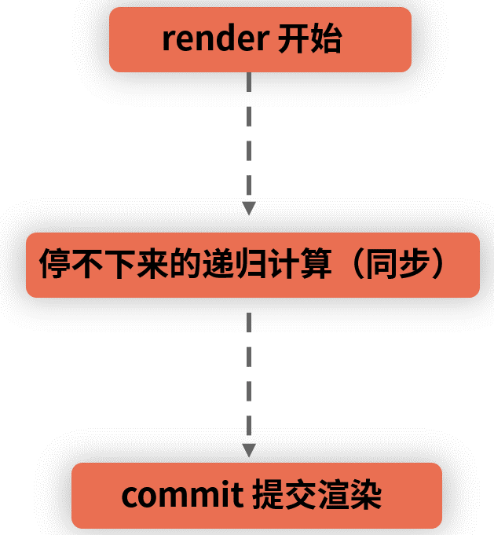
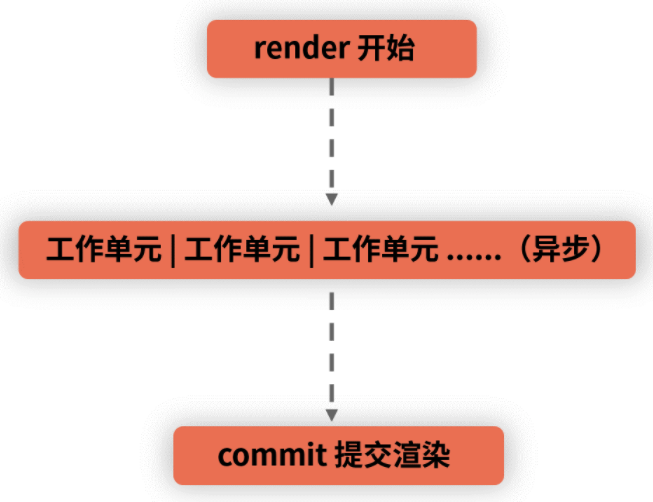

 Fiber 架构的迭代动机与设计思想
 ====
 ### 前置知识：单线程的 JavaScript 与多线程的浏览器
 大家在入门前端的时候，想必都听说过这样一个结论：JavaScript 是单线程的，浏览器是多线程的。

对于多线程的浏览器来说，它除了要处理 JavaScript 线程以外，还需要处理包括事件系统、定时器/延时器、网络请求等各种各样的任务线程，这其中，自然也包括负责处理 DOM 的UI 渲染线程。而 __JavaScript 线程是可以操作 DOM 的__。

这意味着什么呢？试想如果渲染线程和 JavaScript 线程同时在工作，那么渲染结果必然是难以预测的：比如渲染线程刚绘制好的画面，可能转头就会被一段 JavaScript 给改得面目全非。这就决定了 __JavaScript 线程和渲染线程必须是互斥的__：这两个线程不能够穿插执行，必须串行。__当其中一个线程执行时，另一个线程只能挂起等待。__

具有相似特征的还有事件线程，浏览器的 Event-Loop 机制决定了事件任务是由一个异步队列来维持的。当事件被触发时，对应的任务不会立刻被执行，而是由事件线程把它添加到任务队列的末尾，等待 JavaScript的同步代码执行完毕后，在空闲的时间里执行出队。

在这样的机制下，若 JavaScript 线程长时间地占用了主线程，那么 __渲染层面的更新就不得不长时间地等待，界面长时间不更新，带给用户的体验就是所谓的“卡顿”__。一般页面卡顿的时候，你会做什么呢？我个人的习惯是更加频繁地在页面上点来点去，期望页面能够给我哪怕一点点的响应。遗憾的是，__事件线程也在等待 JavaScript，这就导致你触发的事件也将是难以被响应的。__

### 为什么会产生“卡顿”这样的困局？
Stack Reconciler 所带来的一个无解的问题，正是 __JavaScript 对主线程的超时占用问题。__ 为什么会出现这个问题？这就对应上了我们第 10 讲中所强调的一个关键知识点——Stack Reconciler 是一个同步的递归过程。

同步的递归过程，意味着不撞南墙不回头，意味着一旦更新开始，就像吃了炫迈一样，根本停不下来。这里我用一个案例来帮你复习一下这个过程，请先看下面这张图：

在 React 15 及之前的版本中，虚拟 DOM 树的数据结构载体是计算机科学中的“树”，其 Diff 算法的遍历思路，也是沿袭了传统计算机科学中“对比两棵树”的算法，在此基础上优化得来。因此从本质上来说，栈调和机制下的 Diff 算法，其实是 __树的深度优先遍历的过程。__ 而树的深度优先遍历，总是和递归脱不了关系。

拿这棵树来举例，若 A 组件发生了更新，那么栈调和的工作过程是这样的：对比第 1 层的两个 A，确认节点可复用，继续 Diff 其子组件 B、C，确认节点可复用，继续 Diff 其子组件 D、E、F……调和器会重复这个“父组件调用子组件”的过程，直到最深的一层节点更新完毕，才慢慢向上返回。__当整棵树被遍历完成后，reconciler 才能够给出需要修改的 DOM 信息，再交由 renderer 来执行渲染。__

__这个过程的致命性在于它是同步的，不可以被打断。__ 当处理结构相对复杂、体量相对庞大的虚拟 DOM 树时，Stack Reconciler 需要的调和时间会很长，这就意味着 JavaScript 线程将长时间地霸占主线程，进而导致我们上文中所描述的渲染卡顿/卡死、交互长时间无响应等问题。

### 设计思想：Fiber 是如何解决问题的
什么是 Fiber？从字面上来理解，Fiber 这个单词翻译过来是“丝、纤维”的意思，是比线还要细的东西。在计算机科学里，我们有进程、线程之分，而 __Fiber 就是比线程还要纤细的一个过程，也就是所谓的“纤程”。纤程的出现，意在对渲染过程实现更加精细的控制。__

Fiber 是一个多义词。从架构角度来看**，**Fiber 是对 React 核心算法（即调和过程）的重写；从编码角度来看，Fiber 是 React 内部所定义的一种数据结构，它是 Fiber 树结构的节点单位，也就是 React 16 新架构下的“虚拟 DOM”；从工作流的角度来看，Fiber 节点保存了组件需要更新的状态和副作用，一个 Fiber 同时也对应着一个工作单元。

Fiber 架构的应用目的，按照 React 官方的说法，是实现“__增量渲染__”。所谓“增量渲染”，通俗来说就是把一个渲染任务分解为多个渲染任务，而后将其分散到多个帧里面。不过严格来说，增量渲染其实也只是一种手段，__实现增量渲染的目的，是为了实现任务的可中断、可恢复，并给不同的任务赋予不同的优先级，最终达成更加顺滑的用户体验。__

### Fiber 架构核心：“可中断”“可恢复”与“优先级”

在 React 16 之前，React 的渲染和更新阶段依赖的是如下图所示的两层架构：

正如上文所分析的那样，Reconciler 这一层负责对比出新老虚拟 DOM 之间的变化，Renderer 这一层负责将变化的部分应用到视图上，从 Reconciler 到 Renderer 这个过程是严格同步的。

而在 React 16 中，为了实现“可中断”和“优先级”，两层架构变成了如下图所示的三层架构：

多出来的这层架构，叫作“Scheduler（调度器）”，调度器的作用是调度更新的优先级。

在这套架构模式下，更新的处理工作流变成了这样：首先，__每个更新任务都会被赋予一个优先级__。当更新任务抵达调度器时，高优先级的更新任务（记为 A）会更快地被调度进 Reconciler 层；此时若有新的更新任务（记为 B）抵达调度器，调度器会检查它的优先级，若发现 B 的优先级高于当前任务 A，那么当前处于 Reconciler 层的 A 任务就会被中断，调度器会将 B 任务推入 Reconciler 层。当 B 任务完成渲染后，新一轮的调度开始，之前被中断的 __A 任务将会被重新推入 Reconciler 层，继续它的渲染之旅，这便是所谓“可恢复”。__

以上，便是架构层面对“可中断”“可恢复”与“优先级”三个核心概念的处理。

### Fiber 架构对生命周期的影响

在基础篇我们曾经探讨过，React 16 的生命周期分为这样三个阶段，如下图所示：

1. render 阶段：纯净且没有副作用，可能会被 React 暂停、终止或重新启动。
2. pre-commit 阶段：可以读取 DOM。
3. commit 阶段：可以使用 DOM，运行副作用，安排更新。

其中 pre-commit 和 commit 从大阶段上来看都属于 commit 阶段。

在 render 阶段，React 主要是在内存中做计算，明确 DOM 树的更新点；而 commit 阶段，则负责把 render 阶段生成的更新真正地执行掉。这两个阶段做的事情，非常适合和本讲刚刚讲过的 React 架构分层结合起来理解。

首先我们来看 React 15 中从 render 到 commit 的过程：

而在 React 16 中，render 到 commit 的过程变成了这样，如下图所示：

可以看出，新老两种架构对 React 生命周期的影响主要在 render 这个阶段，这个影响是通过增加 Scheduler 层和改写 Reconciler 层来实现的。

在 render 阶段，一个庞大的更新任务被分解为了一个个的工作单元，这些工作单元有着不同的优先级，React 可以根据优先级的高低去实现工作单元的打断和恢复。由于 render 阶段的操作对用户来说其实是“不可见”的，所以就算打断再重启，对用户来说也是 0 感知。但是，工作单元（也就是任务）的重启将会伴随着对部分生命周期的重复执行，这些生命周期是：

* componentWillMount
* componentWillUpdate
* shouldComponentUpdate
* componentWillReceiveProps

其中 shouldComponentUpdate 的作用是通过返回 true 或者 false，来帮助我们判断更新的必要性，一般在这个函数中不会进行副作用操作，因此风险不大。

