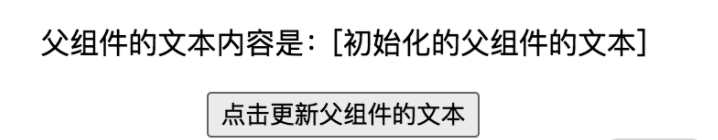

 数据是如何在 React 组间之间流动的？ 数据是如何在 React 组间之间流动的？
 ===
### 基于 props 的单向数据流


单向数据流:指的就是当前组件的 state 以 props 的形式流动时，只能流向组件树中比自己层级更低的组件。 比如在父-子组件这种嵌套关系中，只能由父组件传 props 给子组件，而不能反过来。

#### 父-子组件通信
原理讲解
  这是最常见、也是最好解决的一个通信场景。React 的数据流是单向的，父组件可以直接将 this.props 传入子组件，实现父-子间的通信。
#### 子-父组件通信
##### 原理讲解
考虑到 props 是单向的，子组件并不能直接将自己的数据塞给父组件，但 props 的形式也可以是多样的。假如父组件传递给子组件的是一个绑定了自身上下文的函数，那么子组件在调用该函数时，就可以将想要交给父组件的数据以函数入参的形式给出去，以此来间接地实现数据从子组件到父组件的流动。
##### 编码实现
在 Child 中，我们需要增加对状态的维护，以及对 Father 组件传入的函数形式入参的调用。子组件编码内容如下，修改点我已在代码中以注释的形式标出：
```JavaScript
  class Child extends React.Component {
  // 初始化子组件的 state  
  state = {
    text: '子组件的文本'
  }
  // 子组件的按钮监听函数
  changeText = () => {
    // changeText 中，调用了父组件传入的 changeFatherText 方法
    this.props.changeFatherText(this.state.text)
  }

  render() {
    return (
      <div className="child">
        {/* 注意这里把修改父组件文本的动作放在了 Child 里 */}
        <button onClick={this.changeText}>
          点击更新父组件的文本
        </button>
      </div>
    );
  }
}
```
在父组件中，我们只需要在 changeText 函数上开一个传参的口子，作为数据通信的入口，然后把 changeText 放在 props 里交给子组件即可。父组件的编码内容如下：
```JavaScript
class Father extends React.Component {
  // 初始化父组件的 state
  state = {
    text: "初始化的父组件的文本"
  };
  // 这个方法会作为 props 传给子组件，用于更新父组件 text 值。newText 正是开放给子组件的数据通信入口
  changeText = (newText) => {
    this.setState({
      text: newText
    });
  };
  // 渲染父组件
  render() {
    return (
      <div className="father">
        <p>{`父组件的文本内容是：[${this.state.text}]`}</p>
        {/* 引入子组件，并通过 props 中下发可传参的函数 实现子-父通信 */}
        <Child
          changeFatherText={this.changeText}
        />
      </div>
    );
  }
```
##### 视图层验证
新的示例渲染后的界面大致如下图所示：

注意，在这个 case 中，我们将具有更新数据能力的按钮转移到了子组件中。

#### 兄弟组件通信
##### 原理讲解
兄弟组件之间共享了同一个父组件，如下图所示，这是一个非常重要的先决条件。

这个先决条件使得我们可以继续利用父子组件这一层关系，将“兄弟 1 → 兄弟 2”之间的通信，转化为“兄弟 1 → 父组件”（子-父通信）、“父组件 → 兄弟 2”（父-子）通信两个步骤，如下图所示，这样一来就能够巧妙地把“兄弟”之间的新问题化解为“父子”之间的旧问题。
##### 编码实现
接下来我们仍然从编码的角度进行验证。首先新增一个 NewChild 组件作为与 Child 组件同层级的兄弟组件。NewChild 将作为数据的发送方，将数据发送给 Child。在 NewChild 中，我们需要处理 NewChild 和 Father 之间的关系。NewChild 组件编码如下：
```JavaScript
class NewChild extends React.Component {
  state = {
    text: "来自 newChild 的文本"
  };
  // NewChild 组件的按钮监听函数
  changeText = () => {
    // changeText 中，调用了父组件传入的 changeFatherText 方法
    this.props.changeFatherText(this.state.text);
  };
  render() {
    return (
      <div className="child">
        {/* 注意这里把修改父组件文本（同时也是 Child 组件的文本）的动作放在了 NewChild 里 */}
        <button onClick={this.changeText}>点击更新 Child 组件的文本</button>
      </div>
    );
  }
}
```
接下来看看 Father 组件。在 Father 组件中，我们通过 text 属性连接 Father 和 Child，通过 changeText 函数来连接 Father 和 NewChild。由此便把 text 属性的渲染工作交给了 Child，把 text 属性的更新工作交给 NewÇhild，以此来实现数据从 NewChild 到 Child 的流动。Father 组件编码如下：
```JavaScript
class Father extends React.Component {
  // 初始化父组件的 state
  state = {
    text: "初始化的父组件的文本"
  };
  // 传给 NewChild 组件按钮的监听函数，用于更新父组件 text 值（这个 text 值同时也是 Child 的 props）
  changeText = (newText) => {
    this.setState({
      text: newText
    });
  };
  // 渲染父组件
  render() {
    return (
      <div className="father">
        {/* 引入 Child 组件，并通过 props 中下发具体的状态值 实现父-子通信 */}
        <Child fatherText={this.state.text} />
        {/* 引入 NewChild 组件，并通过 props 中下发可传参的函数 实现子-父通信 */}
        <NewChild changeFatherText={this.changeText} />
      </div>
    );
  }
}
```
##### 视图层验证
编码完成之后，界面大致的结构如下图所示：

现在我点击位于 NewChild 组件中的“点击更新 Child 组件的文本”按钮，就可以看到 Child 会跟着发生变化，如下图所示，进而验证方案的可行性。

### 为什么不推荐用 props 解决其他场景的需求
至此，我们给出了 props 传参这种形式比较适合处理的三种场景。尽管这并不意味着其他场景不能用 props 处理，但如果你试图用简单的 props 传递完成更加复杂的通信需求，往往会得不偿失。这里我给你举一个比较极端的例子：


层层传递的优点是非常简单，用已有知识就能解决，但问题是会浪费很多代码，非常烦琐，中间作为桥梁的组件会引入很多不属于自己的属性。短期来看，写代码的人会很痛苦；长期来看，整个项目的维护成本都会变得非常高昂。因此，层层传递 props 要不得。

### 利用“发布-订阅”模式驱动数据流
#### 理解事件的发布-订阅机制
发布-订阅机制早期最广泛的应用，应该是在浏览器的 DOM 事件中。  相信有过原生 JavaScript 开发经验的同学，对下面这样的用法都不会陌生：
```JavaScript
target.addEventListener(type, listener, useCapture);
```
使用发布-订阅模式的优点在于，__监听事件的位置和触发事件的位置是不受限的__，就算相隔十万八千里，只要它们在同一个上下文里，就能够彼此感知。这个特性，太适合用来应对“任意组件通信”这种场景了。

#### 发布-订阅模型 API 设计思路

在写代码之前，先要捋清楚思路。这里我把“实现 EventEmitter”这个大问题，拆解为 3 个具体的小问题，下面我们逐个来解决。
* 问题一：事件和监听函数的对应关系如何处理？
  
  提到“对应关系”，应该联想到的是“映射”。在 JavaScript 中，处理“映射”我们大部分情况下都是用对象来做的。所以说在全局我们需要设置一个对象，来存储事件和监听函数之间的关系：
  ```JavaScript
    constructor() {
      // eventMap 用来存储事件和监听函数之间的关系
      this.eventMap= {}
    }
  ```
* 问题二：如何实现订阅？
  
  所谓“订阅”，也就是注册事件监听函数的过程。这是一个“写”操作，具体来说就是把事件和对应的监听函数写入到 eventHome 里面去：
  ```JavaScript
    // type 这里就代表事件的名称
    on(type, handler) {
    // hanlder 必须是一个函数，如果不是直接报错
      if(!(handler instanceof Function)) {
        throw new Error("请传一个函数")
      }
      // 判断 type 事件对应的队列是否存在
      if(!this.eventMap[type]) {
        // 若不存在，新建该队列
        this.eventMap[type] = []
      }
      // 若存在，直接往队列里推入 handler
      this.eventMap[type].push(handler)
    }
  ```
* 问题三：如何实现发布？
  订阅操作是一个“写”操作，相应的，发布操作就是一个“读”操作。发布的本质是触发安装在某个事件上的监听函数，我们需要做的就是找到这个事件对应的监听函数队列，将队列中的 handler 依次执行出队：
  ```JavaScript
    // 别忘了我们前面说过触发时是可以携带数据的，params 就是数据的载体
    emit(type, params) {
      // 假设该事件是有订阅的（对应的事件队列存在）
      if(this.eventMap[type]) {
        // 将事件队列里的 handler 依次执行出队
        this.eventMap[type].forEach((handler, index)=> {
          // 注意别忘了读取 params
          handler(params)
        })
      }
    }
  ```
  到这里，最最关键的 on 方法和 emit 方法就实现完毕了。最后我们补充一个 off 方法：
  ```JavaScript
  off(type, handler) {
    if(this.eventMap[type]) {
      this.eventMap[type].splice(this.eventMap[type].indexOf(handler)>>>0,1)
    }
  }
  ```
  接着把这些代码片段拼接进一个 class 里面，一个核心功能完备的 EventEmitter 就完成啦：
  ```JavaScript
    class myEventEmitter {
      constructor() {
        // eventMap 用来存储事件和监听函数之间的关系
        this.eventMap = {};
      }
      // type 这里就代表事件的名称
      on(type, handler) {
        // hanlder 必须是一个函数，如果不是直接报错
        if (!(handler instanceof Function)) {
          throw new Error("哥 你错了 请传一个函数");
        }
        // 判断 type 事件对应的队列是否存在
        if (!this.eventMap[type]) {
          // 若不存在，新建该队列
          this.eventMap[type] = [];
        }
        // 若存在，直接往队列里推入 handler
        this.eventMap[type].push(handler);
      }
      // 别忘了我们前面说过触发时是可以携带数据的，params 就是数据的载体
      emit(type, params) {
        // 假设该事件是有订阅的（对应的事件队列存在）
        if (this.eventMap[type]) {
          // 将事件队列里的 handler 依次执行出队
          this.eventMap[type].forEach((handler, index) => {
            // 注意别忘了读取 params
            handler(params);
          });
        }
      }
      off(type, handler) {
        if (this.eventMap[type]) {
          this.eventMap[type].splice(this.eventMap[type].indexOf(handler) >>> 0, 1);
        }
      }
    }
  ```

现在你可以试想一下，对于任意的两个组件 A 和 B，假如我希望实现双方之间的通信，借助 EventEmitter 来做就很简单了，以数据从 A 流向 B 为例。

我们可以在 B 中编写一个handler（记得将这个 handler 的 this 绑到 B 身上），在这个 handler 中进行以 B 为上下文的 this.setState 操作，然后将这个 handler 作为监听器与某个事件关联起来。比如这样：
```JavaScript
// 注意这个 myEvent 是提前实例化并挂载到全局的，此处不再重复示范实例化过程
const globalEvent = window.myEvent
class B extends React.Component {
  // 这里省略掉其他业务逻辑
  state = {
    newParams: ""
  };
  handler = (params) => {
    this.setState({
      newParams: params
    });
  };
  bindHandler = () => {
    globalEvent.on("someEvent", this.handler);
  };
  render() {
    return (
      <div>
        <button onClick={this.bindHandler}>点我监听A的动作</button>
        <div>A传入的内容是[{this.state.newParams}]</div>
      </div>
    );
  }
}
```
接下来在 A 组件中，只需要直接触发对应的事件，然后将希望携带给 B 的数据作为入参传递给 emit 方法即可。代码如下：
```JavaScript
class A extends React.Component {
  // 这里省略掉其他业务逻辑
  state = {
    infoToB: "哈哈哈哈我来自A"
  };
  reportToB = () => {
    // 这里的 infoToB 表示 A 自身状态中需要让 B 感知的那部分数据
    globalEvent.emit("someEvent", this.state.infoToB);
  };
  render() {
    return <button onClick={this.reportToB}>点我把state传递给B</button>;
  }
}
```
如此一来，便能够实现 A 到 B 的通信了。这里我将 A 与 B 编排为兄弟组件，代码如下：
```JavaScript
export default function App() {
  return (
    <div className="App">
      <B />
      <A />
    </div>
  );
}
```
你也可以在自己的 Demo 里将 A 和 B 定义为更加复杂的嵌套关系，这里我给出的这个 Demo 运行起来会渲染出这样的界面，如下图所示：

依次点击顶部和底部的按钮，就可以实现对 someEvent 这个事件的监听和触发，进而观察到中间这行文本的改变，如下图所示：

由此我们便可以验证到发布-订阅模式驱动 React 数据流的可行性。为了强化你对过程的理解，我将 A 与 B 的通信过程梳理进了一张图里，供你参考：
