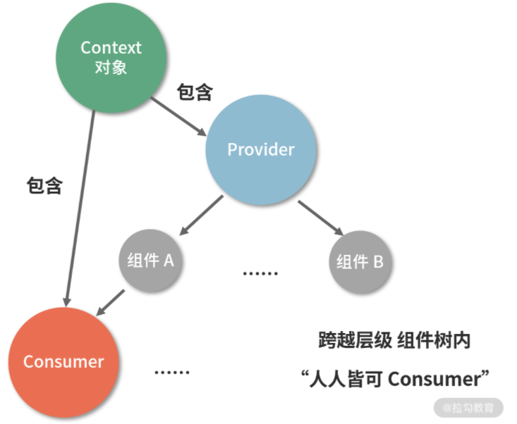
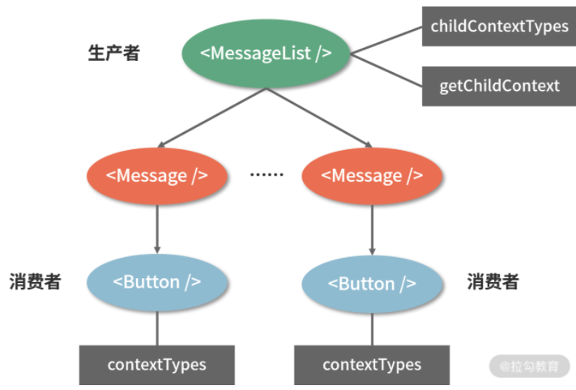
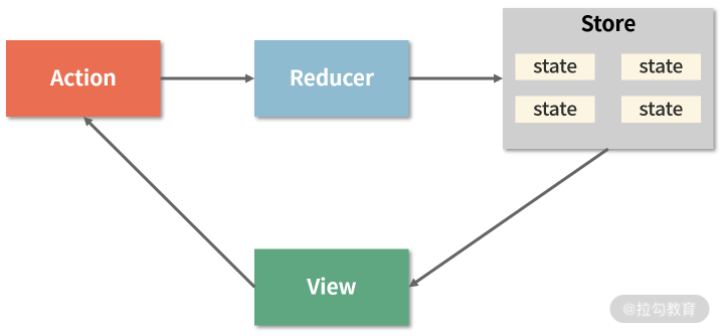
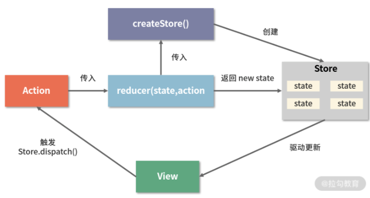

 数据在 React 组间之间流动
 ===
 ### 使用 Context API 维护全局状态
 #### 图解 Context API 工作流
 Context API 有 3 个关键的要素：React.createContext、Provider、Consumer
 我们通过调用 React.createContext，可以创建出一组 Provider。Provider 作为数据的提供方，可以将数据下发给自身组件树中任意层级的 Consumer，这三者之间的关系用一张图来表示：

 

注意：Cosumer 不仅能够读取到 Provider 下发的数据，还能读取到这些数据后续的更新。这意味着数据在生产者和消费者之间能够及时同步，这对 Context 这种模式来说至关重要。

#### 从编码的角度认识“三要素”
* React.createContext，作用是创建一个 context 对象。下面是一个简单的用法示范：
  ```JavaScript
    const AppContext = React.createContext(defaultValue) // defaultValue可不传
  ```
  从创建出的 context 对象中，我们可以读取到 Provider 和 Consumer：
  ```JavaScript
    const { Provider, Consumer } = AppContext
  ```
* Provider，可以理解为“数据的 Provider（提供者）”。
我们使用 Provider 对组件树中的根组件进行包裹，然后传入名为“value”的属性，这个 value 就是后续在组件树中流动的“数据”，它可以被 Consumer 消费。使用示例如下：
  ```JavaScript
    <Provider value={title: this.state.title, content: this.state.content}>
      <Title />
      <Content />
    </Provider>
  ```
* Consumer，顾名思义就是“数据的消费者”，它可以读取 Provider 下发下来的数据。
  其特点是需要接收一个函数作为子元素，这个函数需要返回一个组件。像这样：
  ```JavaScript
    <Consumer>
      {value => <div>{value.title}</div>}
    </Consumer>
  ```
  注意，当 Consumer 没有对应的 Provider 时，value 参数会直接取创建 context 时传递给 createContext 的 defaultValue。
#### 新的 Context API 解决了什么问题
想要知道新的 Context API 解决了什么问题，先要知道过时的 Context API 存在什么问题。
##### 我们先从编码角度认识“过时的”Context API
```JavaScript
import PropTypes from 'prop-types';
class Button extends React.Component {
  render() {
    return (
      <button style={{background: this.context.color}}>
        {this.props.children}
      </button>
    );
  }
}
Button.contextTypes = {
  color: PropTypes.string
};
class Message extends React.Component {
  render() {
    return (
      <div>
        {this.props.text} <Button>Delete</Button>
      </div>
    );
  }
}
class MessageList extends React.Component {
  getChildContext() {
    return {color: "purple"};
  }
  render() {
    const children = this.props.messages.map((message) =>
      <Message text={message.text} />
    );
    return <div>{children}</div>;
  }
}
MessageList.childContextTypes = {
  color: PropTypes.string
};
```
上述代码对应的组织结构梳理到一张图里，如下图所示：



借着这张图，我们来理解旧的 Context API 的工作过程：
* 首先，通过给 MessageList 设置 childContextTypes 和 getChildContext，可以使其承担起 context 的生产者的角色；
* 然后，MessageList 的组件树内部所有层级的组件都可以通过定义 contextTypes 来成为数据的消费者，进而通过 this.context 访问到 MessageList 提供的数据。
“过时的” Context API 存在的问题：
首先映入眼帘的第一个问题是代码不够优雅：一眼望去，你很难迅速辨别出谁是 Provider、谁是 Consumer。同时这琐碎的属性设置和 API 编写过程，也足够我们写代码的时候“喝一壶了”。总而言之，从编码形态的角度来说，“过时的” Context API 和新 Context API 相去甚远。
不过，这还不是最要命的，最要命的弊端我们从编码层面暂时感知不出来，但是一旦你感知到它，麻烦就大了——前面我们特别提到过，“Cosumer 不仅能够读取到 Provider 下发的数据，__还能够读取到这些数据后续的更新__”。数据在生产者和消费者之间的及时同步，这一点对于 Context 这种模式来说是至关重要的，但旧的 Conext API 无法保证这一点：
<pre>
  <code>
    如果组件提供的一个Context发生了变化，而中间父组件的 shouldComponentUpdate 返回 false，那么使用到该值的后代组件不会进行更新。使用了 Context 的组件则完全失控，所以基本上没有办法能够可靠的更新 Context。这篇博客文章很好地解释了为何会出现此类问题，以及你该如何规避它。  ——React 官方
  </code>
</pre>
新的 Context API 改进了这一点：__即便组件的 shouldComponentUpdate 返回 false，它仍然可以“穿透”组件继续向后代组件进行传播，进而确保了数据生产者和数据消费者之间数据的一致性__。再加上更加“好看”的语义化的声明式写法，新版 Context API 终于顺利地摘掉了“试验性 API”的帽子，成了一种确实可行的 React 组件间通信解决方案。
### 第三方数据流框架：初探 Redux
对于简单的跨层级组件通信，我们可以使用发布-订阅模式或者 Context API 来搞定。但是随着应用的复杂度不断提升，需要维护的状态越来越多，组件间的关系也越来越难以处理的时候，我们就需要请出 Redux 来帮忙了
#### 什么是 Redux
我们先来看一下官方对 Redux 的描述：
<pre>
  Redux 是 JavaScript 状态容器，它提供可预测的状态管理。
</pre>
#### Redux 是如何帮助 React 管理数据的
Redux 主要由三部分组成：store、reducer 和 action。我们先来看看它们各自代表什么：
* store 就好比组件群里的“群文件”，它是一个单一的数据源，而且是只读的；
* action 人如其名，是“动作”的意思，它是对变化的描述。
举个例子，下面这个对象就是一个 action：
```JavaScript
const action = {
  type: "ADD_ITEM",
  payload: '<li>text</li>'
}
```
* reducer 是一个函数，它负责**对变化进行分发和处理，**最终将新的数据返回给 store。
store、action 和 reducer 三者紧密配合，便形成了 Redux 独树一帜的工作流：



从上图中，我们首先读出的是数据的流向规律：__在 Redux 的整个工作过程中，数据流是严格单向的__。
接下来仍然是围绕上图，我们来一起看看 Redux 是如何帮助 React 管理数据流的。对于一个 React 应用来说，视图（View）层面的所有数据（state）都来自 store（再一次诠释了单一数据源的原则）。
如果你想对数据进行修改，只有一种途径：派发 action。action 会被 reducer 读取，进而根据 action 内容的不同对数据进行修改、生成新的 state（状态），这个新的 state 会更新到 store 对象里，进而驱动视图层面做出对应的改变。
对于组件来说，任何组件都可以通过约定的方式从 store 读取到全局的状态，任何组件也都可以通过合理地派发 action 来修改全局的状态。__Redux 通过提供一个统一的状态容器，使得数据能够自由而有序地在任意组件之间穿梭__，这就是 Redux 实现组件间通信的思路。
#### 从编码的角度理解 Redux 工作流
1. 使用 createStore 来完成 store 对象的创建
```JavaScript
  // 引入 redux
import { createStore } from 'redux'
// 创建 store
const store = createStore(
    reducer,
    initial_state,
    applyMiddleware(middleware1, middleware2, ...)
);
```
createStore 方法是一切的开始，它接收三个入参：
* reducer；
* 初始状态内容；
* 指定中间件（这个你先不用管）。
2. reducer 的作用是将新的 state 返回给 store
一个 reducer 一定是一个纯函数，它可以有各种各样的内在逻辑，但它最终一定要返回一个 state：
```JavaScript
const reducer = (state, action) => {
    // 此处是各种样的 state处理逻辑
    return new_state
}
```
当我们基于某个 reducer 去创建 store 的时候，其实就是给这个 store 指定了一套更新规则：
```JavaScript
// 更新规则全都写在 reducer 里 
const store = createStore(reducer)
```
3. action 的作用是通知 reducer “让改变发生”
__要想让 state 发生改变，就必须用正确的 action 来驱动这个改变。__
前面我们已经介绍过 action 的形态，这里再提点一下。首先，action 是一个大致长这样的对象：
```JavaScript
const action = {
  type: "ADD_ITEM",
  payload: '<li>text</li>'
}
```
4. 派发 action，靠的是 dispatch
action 本身只是一个对象，要想让 reducer 感知到 action，还需要“派发 action”这个动作，这个动作是由 store.dispatch 完成的。这里我简单地示范一下：
```JavaScript
import { createStore } from 'redux'
// 创建 reducer
const reducer = (state, action) => {
    // 此处是各种各样的 state处理逻辑
    return new_state
}
// 基于 reducer 创建 state
const store = createStore(reducer)
// 创建一个 action，这个 action 用 “ADD_ITEM” 来标识 
const action = {
  type: "ADD_ITEM",
  payload: '<li>text</li>'
}
// 使用 dispatch 派发 action，action 会进入到 reducer 里触发对应的更新
store.dispatch(action)
```
对应的流程图：


