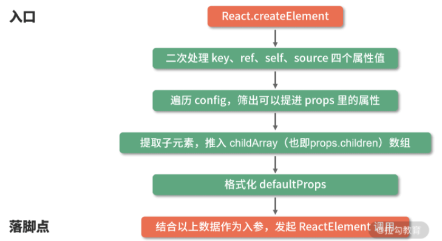
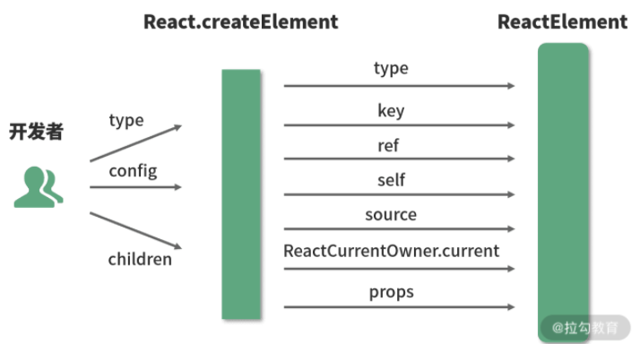
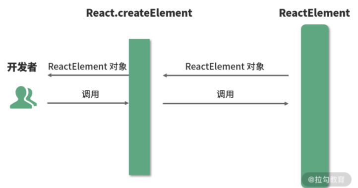

JSX
====
1. JSX 的本质是什么，它和 JS 之间到底是什么关系？
   ####JSX 的本质：JavaScript 的语法扩展
   ###JSX 语法是如何在 JavaScript 中生效的：认识 Babel
   <pre>
    JSX 会被编译为 React.createElement()， React.createElement() 将返回一个叫作“React Element”的 JS 对象。
   </pre>
   这里提到，JSX 在被编译后，会变成一个针对 React.createElement 的调用，此时你大可不必急于关注 React.createElement 这个 API 到底做了什么（下文会单独讲解）。咱们先来说说这个“编译”是怎么回事：“编译”这个动作，是由 Babel 来完成的。
   #### 什么是 Babel 呢？
   <pre>
    Babel 是一个工具链，主要用于将 ECMAScript 2015+ 版本的代码转换为向后兼容的 JavaScript 语法，以便能够运行在当前和旧版本的浏览器或其他环境中。
   </pre>
    类似的，Babel 也具备将 JSX 语法转换为 JavaScript 代码的能力
    
    由上图可知，所有的 JSX 标签都被转化成了 React.createElement 调用，这也就意味着，我们写的 JSX 其实写的就是 React.createElement，虽然它看起来有点像 HTML，但也只是“看起来像”而已。
      ###JSX 的本质是React.createElement这个 JavaScript 调用的语法糖
    这也就完美地呼应上了 React 官方给出的“JSX 充分具备 JavaScript 的能力”这句话。


2. 为什么要用 JSX？不用会有什么后果？
   
   换个角度想想，既然 JSX 等价于一次 React.createElement 调用，那么 React 官方为什么不直接引导我们用 React.createElement 来创建元素呢？

   原因非常简单，我们来看一个相对复杂一些的组件的 JSX 代码和 React.createElement 调用之间的对比。它们各自的形态如下图所示，图中左侧是 JSX 代码，右侧是 React.createElement 调用：
   

   你会发现，在实际功能效果一致的前提下，JSX 代码层次分明、嵌套关系清晰；而 React.createElement 代码则给人一种非常混乱的“杂糅感”，这样的代码不仅读起来不友好，写起来也费劲。

   #### JSX 语法糖允许前端开发者使用我们最为熟悉的类 HTML 标签语法来创建虚拟 DOM，在降低学习成本的同时，也提升了研发效率与研发体验。
   
3. JSX 背后的功能模块是什么，这个功能模块都做了哪些事情？
   ```JavaScript
   /**

      101. React的创建元素方法

      */

      export function createElement(type, config, children) {

        // propName 变量用于储存后面需要用到的元素属性

        let propName; 

        // props 变量用于储存元素属性的键值对集合

        const props = {}; 

        // key、ref、self、source 均为 React 元素的属性，此处不必深究

        let key = null;

        let ref = null; 

        let self = null; 

        let source = null; 

        // config 对象中存储的是元素的属性

        if (config != null) { 

          // 进来之后做的第一件事，是依次对 ref、key、self 和 source 属性赋值

          if (hasValidRef(config)) {

            ref = config.ref;

          }

          // 此处将 key 值字符串化

          if (hasValidKey(config)) {

            key = '' + config.key; 

          }

          self = config.__self === undefined ? null : config.__self;

          source = config.__source === undefined ? null : config.__source;

          // 接着就是要把 config 里面的属性都一个一个挪到 props 这个之前声明好的对象里面

          for (propName in config) {

            if (

              // 筛选出可以提进 props 对象里的属性

              hasOwnProperty.call(config, propName) &&  /

              !RESERVED_PROPS.hasOwnProperty(propName) 

            ) {

              props[propName] = config[propName]; 

            }

          }

        }

        // childrenLength 指的是当前元素的子元素的个数，减去的 2 是 type 和 config 两个参数占用的长度

        const childrenLength = arguments.length - 2; 

        // 如果抛去type和config，就只剩下一个参数，一般意味着文本节点出现了

        if (childrenLength === 1) { 

          // 直接把这个参数的值赋给props.children

          props.children = children; 

          // 处理嵌套多个子元素的情况

        } else if (childrenLength > 1) { 

          // 声明一个子元素数组

          const childArray = Array(childrenLength); 

          // 把子元素推进数组里

          for (let i = 0; i < childrenLength; i++) { 

            childArray[i] = arguments[i + 2];

          }

          // 最后把这个数组赋值给props.children

          props.children = childArray; 

        } 

        // 处理 defaultProps

        if (type && type.defaultProps) {

          const defaultProps = type.defaultProps;

          for (propName in defaultProps) { 

            if (props[propName] === undefined) {

              props[propName] = defaultProps[propName];

            }

          }

        }

        // 最后返回一个调用ReactElement执行方法，并传入刚才处理过的参数

        return ReactElement(

          type,

          key,

          ref,

          self,

          source,

          ReactCurrentOwner.current,

          props,

        );

      }

   ```

   ### 入参解读：创造一个元素需要知道哪些信息

   <code>
    export function createElement(type, config, children)
   </code>

   createElement 有 3 个入参，这 3 个入参囊括了 React 创建一个元素所需要知道的全部信息。
   * type：用于标识节点的类型。它可以是类似“h1”“div”这样的标准 HTML 标签字符串，也可以是 React 组件类型或 React fragment 类型。
   * config：以对象形式传入，组件所有的属性都会以键值对的形式存储在 config 对象中。
   * children：以对象形式传入，它记录的是组件标签之间嵌套的内容，也就是所谓的“子节点”“子元素”
  
    ### createElement 函数体拆解

  

  createElement 中并没有十分复杂的涉及算法或真实 DOM 的逻辑，它的每一个步骤几乎都是在格式化数据。
  说得更直白点，createElement 就像是开发者和 ReactElement 调用之间的一个“转换器”、一个数据处理层。它可以从开发者处接受相对简单的参数，然后将这些参数按照 ReactElement 的预期做一层格式化，最终通过调用 ReactElement 来实现元素的创建。整个过程如下图所示：

  
  ### 出参解读：初识虚拟 DOM
  上面已经分析过，createElement 执行到最后会 return 一个针对 ReactElement 的调用。这里关于 ReactElement，我依然先给出源码 + 注释形式的解析：
  ```JavaScript
    const ReactElement = function(type, key, ref, self, source, owner, props) {

      const element = {

        // REACT_ELEMENT_TYPE是一个常量，用来标识该对象是一个ReactElement

        $$typeof: REACT_ELEMENT_TYPE,

        // 内置属性赋值

        type: type,

        key: key,

        ref: ref,

        props: props,

        // 记录创造该元素的组件

        _owner: owner,

      };

      // 

      if (__DEV__) {

        // 这里是一些针对 __DEV__ 环境下的处理，对于大家理解主要逻辑意义不大，此处我直接省略掉，以免混淆视听

      }

      return element;

    };

  ```
  ReactElement 的代码出乎意料的简短，从逻辑上我们可以看出，ReactElement 其实只做了一件事情，那就是“创建”，说得更精确一点，是“组装”：ReactElement 把传入的参数按照一定的规范，“组装”进了 element 对象里，并把它返回给了 React.createElement，最终 React.createElement 又把它交回到了开发者手中。整个过程如下图所示：
  

  这个 ReactElement 对象实例，本质上是以 JavaScript 对象形式存在的对 DOM 的描述，也就是老生常谈的“虚拟 DOM”(准确地说，是虚拟 DOM 中的一个节点)
  既然是“虚拟 DOM”，那就意味着和渲染到页面上的真实 DOM 之间还有一些距离，这个“距离”，就是由大家喜闻乐见的ReactDOM.render方法来填补的。

  在每一个 React 项目的入口文件中，都少不了对 React.render 函数的调用。下面我简单介绍下 ReactDOM.render 方法的入参规则：
  ```JavaScript
    ReactDOM.render(
      // 需要渲染的元素（ReactElement）
      element, 
      // 元素挂载的目标容器（一个真实DOM）
      container,
      // 回调函数，可选参数，可以用来处理渲染结束后的逻辑
      [callback]
  )
  ```
  ReactDOM.render 方法可以接收 3 个参数，其中第二个参数就是一个真实的 DOM 节点，这个真实的 DOM 节点充当“容器”的角色，React 元素最终会被渲染到这个“容器”里面去。比如，示例中的 App 组件，它对应的 render 调用是这样的：
  ```JavaScript
  const rootElement = document.getElementById("root");
  ReactDOM.render(<App />, rootElement);
  ```

  注意，这个真实 DOM 一定是确实存在的。比如，在 App 组件对应的 index.html 中，已经提前预置 了 id 为 root 的根节点：
  ```JavaScript
  <body>
    <div id="root"></div>
  </body>
  ```