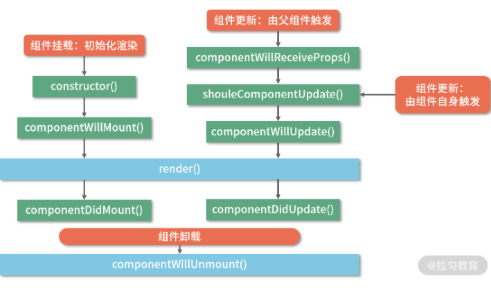
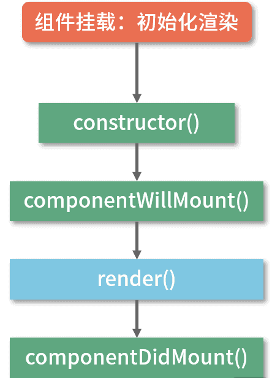
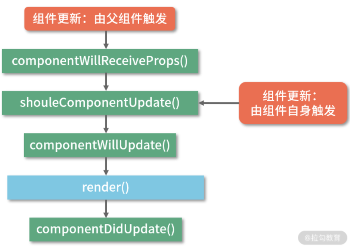

React 15生命周期
==
### 生命周期背后的设计思想：把握 React 中的“大方向”
如果你经常翻阅 React 官网或者 React 官方的一些文章，你会发现“组件”和“虚拟 DOM”这两个词的出镜率是非常高的，它们是 React 基本原理中极为关键的两个概念，也是我们这个小节的学习切入点。
#### 虚拟 DOM：核心算法的基石

组件在初始化时，会通过调用生命周期中的 render 方法，生成虚拟 DOM，然后再通过调用 ReactDOM.render 方法，实现虚拟 DOM 到真实 DOM 的转换。

当组件更新时，会再次通过调用 render 方法生成新的虚拟 DOM，然后借助 diff（这是一个非常关键的算法，我将在“模块二：核心原理”重点讲解）定位出两次虚拟 DOM 的差异，从而针对发生变化的真实 DOM 作定向更新。

#### 组件化：工程化思想在框架中的落地

在一个 React 项目中，几乎所有的可见/不可见的内容都可以被抽离为各种各样的组件，每个组件既是“封闭”的，也是“开放”的。
所谓“封闭”，主要是针对“渲染工作流”（指从组件数据改变到组件实际更新发生的过程）来说的。在组件自身的渲染工作流中，每个组件都只处理它内部的渲染逻辑。在没有数据流交互的情况下，组件与组件之间可以做到“各自为政”。
而所谓“开放”，则是针对组件间通信来说的。React 允许开发者基于“单向数据流”的原则完成组件间的通信。而组件之间的通信又将改变通信双方/某一方内部的数据，进而对渲染结果构成影响。所以说在数据这个“红娘”的牵线搭桥之下，组件之间又是彼此开放的，是可以相互影响的。

### 拆解 React 生命周期：从 React 15 说起

在 React 15 中，大家需要关注以下几个生命周期方法：
```JavaScript
  constructor()

  componentWillReceiveProps()

  shouldComponentUpdate()

  componentWillMount()

  componentWillUpdate()

  componentDidUpdate()

  componentDidMount()

  render()

  componentWillUnmount()

```
这些生命周期方法是如何彼此串联、相互依存的呢？


#### Mounting 阶段：组件的初始化渲染（挂载）
挂载过程在组件的一生中仅会发生一次，在这个过程中，组件被初始化，然后会被渲染到真实 DOM 里，完成所谓的“首次渲染”。

在挂载阶段，一个 React 组件会按照顺序经历如下图所示的生命周期：


componentWillMount、componentDidMount 方法同样只会在挂载阶段被调用一次。其中 componentWillMount 会在执行 render 方法前被触发，一些同学习惯在这个方法里做一些初始化的操作，但这些操作往往会伴随一些风险或者说不必要性

接下来 render 方法被触发。注意 render 在执行过程中并不会去操作真实 DOM（也就是说不会渲染），它的职能是把需要渲染的内容返回出来。真实 DOM 的渲染工作，在挂载阶段是由 ReactDOM.render 来承接的。

componentDidMount 方法在渲染结束后被触发，此时因为真实 DOM 已经挂载到了页面上，我们可以在这个生命周期里执行真实 DOM 相关的操作。此外，类似于异步请求、数据初始化这样的操作也大可以放在这个生命周期来做（侧面印证了 componentWillMount 真的很鸡肋）。

#### Updating 阶段：组件的更新
组件的更新分为两种：一种是由父组件更新触发的更新；另一种是组件自身调用自己的 setState 触发的更新。


componentWillReceiProps 到底是由什么触发的？
从图中你可以明显看出，父组件触发的更新和组件自身的更新相比，多出了这样一个生命周期方法：
```JavaScript
  componentWillReceiveProps(nextProps)
```
在这个生命周期方法里，nextProps 表示的是接收到新 props 内容，而现有的 props （相对于 nextProps 的“旧 props”）我们可以通过 this.props 拿到，由此便能够感知到 props 的变化。

*__componentReceiveProps 并不是由 props 的变化触发的，而是由父组件的更新触发的__*，这个结论，请你谨记。

#### 组件自身 setState 触发的更新
componentWillUpdate 会在 render 前被触发，它和 componentWillMount 类似，允许你在里面做一些不涉及真实 DOM 操作的准备工作；而 componentDidUpdate 则在组件更新完毕后被触发，和 componentDidMount 类似，这个生命周期也经常被用来处理 DOM 操作。此外，我们也常常将 componentDidUpdate 的执行作为子组件更新完毕的标志通知到父组件。

#### render 与性能：初识 shouldComponentUpdate
这里需要重点提一下 shouldComponentUpdate 这个生命周期方法，它的调用形式如下所示：
```JavaScript
  shouldComponentUpdate(nextProps, nextState)
```

render 方法由于伴随着对虚拟 DOM 的构建和对比，过程可以说相当耗时。而在 React 当中，很多时候我们会不经意间就频繁地调用了 render。为了避免掉不必要的 render 操作带来的性能开销，React 为我们提供了 shouldComponentUpdate 这个口子。

React 组件会根据 shouldComponentUpdate 的返回值，来决定是否执行该方法之后的生命周期，进而决定是否对组件进行re-render（重渲染）。shouldComponentUpdate 的默认值为 true，也就是说“无条件 re-render”。在实际的开发中，我们往往通过手动往 shouldComponentUpdate 中填充判定逻辑，或者直接在项目中引入 PureComponent 等最佳实践，来实现“有条件的 re-render”。

#### Unmounting 阶段：组件的卸载
组件的销毁阶段本身是比较简单的，只涉及一个生命周期


这个生命周期本身不难理解，我们重点说说怎么触发它。组件销毁的常见原因有以下两个:
* 组件在父组件中被移除了：这种情况相对比较直观，对应的就是我们上图描述的这个过程；
* 组件中设置了 key 属性，父组件在 render 的过程中，发现 key 值和上一次不一致，那么这个组件就会被干掉。