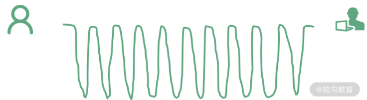

React 16生命周期
====

### 进化的生命周期方法：React 16 生命周期工作流详解
Ract 16.3生命周期流程图：


React 16 以来的生命周期也可以按照“挂载”“更新”和“卸载”三个阶段来看，所以接下来我们要做的事情仍然是分阶段拆解工作流程。在这个过程中，我将把 React 16 新增的生命周期方法，以及流程上相对于 React 15 产生的一些差异，作为我们学习的重点。对于和 React 15 保持一致的部分，这里不再重复讲解。

### Mounting 阶段：组件的初始化渲染（挂载）

React 15和16版本挂载阶段，生命周期 如下：


#### 消失的 componentWillMount，新增的 getDerivedStateFromProps

从上图中不难看出，React 15 生命周期和 React 16.3 生命周期在挂载阶段的主要差异在于，废弃了 componentWillMount，新增了 getDerivedStateFromProps

<pre>
  <code>
    注：细心的你可能记得，React 16 对 render 方法也进行了一些改进。React 16 之前，render方法必须返回单个元素，而 React 16 允许我们返回元素数组和字符串。但本课时我们更加侧重讨论的是生命周期升级过程中的“主要矛盾”，也就是“工作流”层面的改变，故对现有方法的迭代细节，以及不在主要工作流里的componentDidCatch 等生命周期不再予以赘述。
  </code>
</pre>

#### getDerivedStateFromProps 不是 componentWillMount 的替代品

事实上，__componentWillMount 的存在不仅“鸡肋”而且危险，因此它并不值得被“代替”，它就应该被废弃__。 为了证明这点，我将在本文后续的“透过现象看本质”环节为大家细数 componentWillMount 的几宗“罪”。

而 getDerivedStateFromProps 这个 API，其设计的初衷不是试图替换掉**componentWillMount，**而是试图替换掉 componentWillReceiveProps，因此它有且仅有一个用途：__使用 props 来派生/更新 state__。

React 团队为了确保 getDerivedStateFromProps 这个生命周期的纯洁性，直接从命名层面约束了它的用途（getDerivedStateFromProps 直译过来就是“从 Props 里派生 State”）。所以，如果你不是出于这个目的来使用 getDerivedStateFromProps，原则上来说都是不符合规范的。

值得一提的是，getDerivedStateFromProps 在更新和挂载两个阶段都会“出镜”（这点不同于仅在更新阶段出现的 componentWillReceiveProps）。这是因为“派生 state”这种诉求不仅在 props 更新时存在，在 props 初始化的时候也是存在的。

#### 认识 getDerivedStateFromProps

这个新生命周期方法的调用规则如下：
```JavaScript
  static getDerivedStateFromProps(props, state)
```
第一个重点是最特别的一点：__getDerivedStateFromProps 是一个静态方法__。静态方法不依赖组件实例而存在，因此你在这个方法内部是__访问不到 this__ 的
第二个重点，该方法可以接收两个参数：props 和 state，它们分别代表当前组件接收到的来自父组件的 props 和当前组件自身的 state。
第三个重点，getDerivedStateFromProps 需要一个对象格式的返回值。如果你没有指定这个返回值，那么大概率会被 React 警告一番，警告内容如下图所示：


__getDerivedStateFromProps 的返回值之所以不可或缺，是因为 React 需要用这个返回值来更新（派生）组件的 state__。因此当你确实不存在“使用 props 派生 state ”这个需求的时候，最好是直接省略掉这个生命周期方法的编写，否则一定记得给它 return 一个 null。
注意，__getDerivedStateFromProps 方法对 state 的更新动作并非“覆盖”式的更新，而是针对某个属性的定向更新。__

### Updating 阶段：组件的更新
React 15 与 React 16.3 的更新流程对比如下图所示：


注意，咱们前面提到 React 16.4 对生命周期流程进行了“微调”，其实就调在了更新过程的getDerivedStateFromProps 这个生命周期上。先来看一张 React 16.4+ 的生命周期大图:

React 16.4 的挂载和卸载流程都是与 React 16.3 保持一致的，差异在于更新流程上：
* 在 React 16.4 中，任何因素触发的组件更新流程（包括由 this.setState 和 forceUpdate 触发的更新流程）都会触发 getDerivedStateFromProps；
* 而在 v 16.3 版本时，只有父组件的更新会触发该生命周期。
#### 为什么要用 getDerivedStateFromProps 代替componentWillReceiveProps？
对于 getDerivedStateFromProps 这个 API，React 官方曾经给出过这样的描述
<pre>
  与 componentDidUpdate 一起，这个新的生命周期涵盖过时componentWillReceiveProps 的所有用例。
</pre>
在这里，请你细细品味这句话，这句话里蕴含了下面两个关键信息：
* getDerivedStateFromProps 是作为一个试图代替 componentWillReceiveProps 的 API 而出现的；
* getDerivedStateFromProps不能完全和 componentWillReceiveProps 画等号，其特性决定了我们曾经在 componentWillReceiveProps 里面做的事情，不能够百分百迁移到getDerivedStateFromProps 里。
接下来我们就展开说说这两点。
* 关于 getDerivedStateFromProps 是如何代替componentWillReceiveProps 的，在“挂载”环节已经讨论过：getDerivedStateFromProps 可以代替 componentWillReceiveProps 实现基于 props 派生 state。
* 至于它为何不能完全和 componentWillReceiveProps 画等号，则是因为它过于“专注”了。这一点，单单从getDerivedStateFromProps 这个 API 名字上也能够略窥一二。原则上来说，它能做且只能做这一件事。

因此，getDerivedStateFromProps 生命周期替代 componentWillReceiveProps 的背后，__是 React 16 在强制推行“只用 getDerivedStateFromProps 来完成 props 到 state 的映射”这一最佳实践__。意在确保生命周期函数的行为更加可控可预测，从根源上帮开发者避免不合理的编程方式，避免生命周期的滥用；同时，也是在为新的 Fiber 架构铺路。
  
#### 消失的 componentWillMount 与新增的 getSnapshotBeforeUpdate

咱们先来看看 getSnapshotBeforeUpdate 是什么：
```JavaScript
  getSnapshotBeforeUpdate(prevProps, prevState) {
    // ...
  }
```
这个方法和 getDerivedStateFromProps 颇有几分神似，它们都强调了“我需要一个返回值”这回事。区别在于 __getSnapshotBeforeUpdate 的返回值会作为第三个参数给到 componentDidUpdate。它的执行时机是在 render 方法之后，真实 DOM 更新之前__。在这个阶段里，我们可以__同时获取到更新前的真实 DOM 和更新前后的 state&props 信息。__
getSnapshotBeforeUpdate例子：实现一个内容会发生变化的滚动列表，要求根据滚动列表的内容是否发生变化，来决定是否要记录滚动条的当前位置。
这个需求的前半截要求我们对比更新前后的数据（感知变化），后半截则需要获取真实的 DOM 信息（获取位置），这时用 getSnapshotBeforeUpdate 来解决就再合适不过了。
对于这个生命周期，需要重点把握的是它与 componentDidUpdate 间的通信过程。在 Demo 中我给出了一个使用示例，它将帮助你更加具体地认知这个过程。代码如下：

复制代码

```JavaScript
// 组件更新时调用
getSnapshotBeforeUpdate(prevProps, prevState) {
  console.log("getSnapshotBeforeUpdate方法执行");
  return "haha";
}
// 组件更新后调用
componentDidUpdate(nextProps, nextState, valueFromSnapshot) {
  console.log("componentDidUpdate方法执行");
  console.log("从 getSnapshotBeforeUpdate 获取到的值是", valueFromSnapshot);
}
```
值得一提的是，这个生命周期的设计初衷，是为了“与 componentDidUpdate 一起，涵盖过时的 componentWillUpdate 的所有用例”（引用自 React 官网）。getSnapshotBeforeUpdate 要想发挥作用，__离不开 componentDidUpdate 的配合。__
### Unmounting 阶段：组件的卸载
我们先继续把完整的生命周期流程走完，以下是组件卸载阶段的示意图

卸载阶段的生命周期与 React 15 完全一致，只涉及 componentWillUnmount 这一个生命周期，此处不再重复讲解。
### 透过现象看本质：React 16 缘何两次求变？
Fiber 架构简析
Fiber 会使原本同步的渲染过程变成异步的。
在 React 16 之前，每当我们触发一次组件的更新，React 都会构建一棵新的虚拟 DOM 树，通过与上一次的虚拟 DOM 树进行 diff，实现对 DOM 的定向更新。这个过程，是一个递归的过程。下面这张图形象地展示了这个过程的特征：

如图所示，同步渲染的递归调用栈是非常深的，只有最底层的调用返回了，整个渲染过程才会开始逐层返回。__这个漫长且不可打断的更新过程，将会带来用户体验层面的巨大风险：同步渲染一旦开始，便会牢牢抓住主线程不放，直到递归彻底完成。在这个过程中，浏览器没有办法处理任何渲染之外的事情，会进入一种无法处理用户交互的状态__。因此若渲染时间稍微长一点，页面就会面临卡顿甚至卡死的风险。

而 React 16 引入的 Fiber 架构，恰好能够解决掉这个风险：__Fiber 会将一个大的更新任务拆解为许多个小任务__。每当执行完一个小任务时，渲染线程都会把主线程交回去，看看有没有优先级更高的工作要处理，确保不会出现其他任务被“饿死”的情况，进而避免同步渲染带来的卡顿。在这个过程中，渲染线程不再“一去不回头”，而是可以被打断的，这就是所谓的“异步渲染”，它的执行过程如下图所示：


Fiber 架构的重要特征就是可以被打断的异步渲染模式。但这个“打断”是有原则的，根据“能否被打断”这一标准，React 16 的生命周期被划分为了 render 和 commit 两个阶段，而 commit 阶段又被细分为了 pre-commit 和 commit。每个阶段所涵盖的生命周期如下图所示：

我们先来看下三个阶段各自有哪些特征（以下特征翻译自上图）。
* render 阶段：纯净且没有副作用，可能会被 React 暂停、终止或重新启动。
* pre-commit 阶段：可以读取 DOM。
* commit 阶段：可以使用 DOM，运行副作用，安排更新。
#### 总的来说，render 阶段在执行过程中允许被打断，而 commit 阶段则总是同步执行的。

### 细说生命周期“废旧立新”背后的思考

在 Fiber 机制下，__render 阶段是允许暂停、终止和重启的__。当一个任务执行到一半被打断后，下一次渲染线程抢回主动权时，这个任务被重启的形式是“重复执行一遍整个任务”而非“接着上次执行到的那行代码往下走”。__这就导致 render 阶段的生命周期都是有可能被重复执行的。__
带着这个结论，我们再来看看 React 16 打算废弃的是哪些生命周期：

* componentWillMount；
* componentWillUpdate；
* componentWillReceiveProps。

这些生命周期的共性，__就是它们都处于 render 阶段，都可能重复被执行__，而且由于这些 API 常年被滥用，它们在重复执行的过程中都存在着不可小觑的风险。
总的来说，__React 16 改造生命周期的主要动机是为了配合 Fiber 架构带来的异步渲染机制__ 在这个改造的过程中，React 团队精益求精，针对生命周期中长期被滥用的部分推行了具有强制性的最佳实践。这一系列的工作做下来，首先是确保了 Fiber 机制下数据和视图的安全性，同时也确保了生命周期方法的行为更加纯粹、可控、可预测。