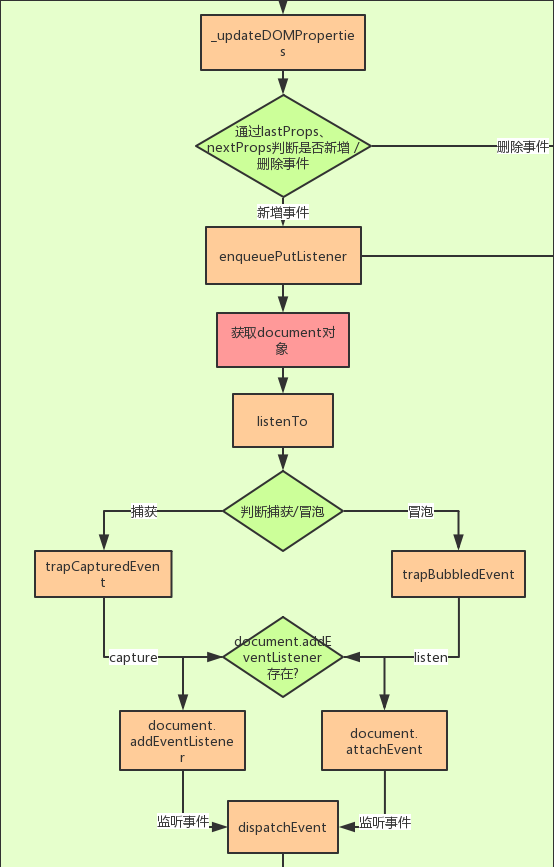
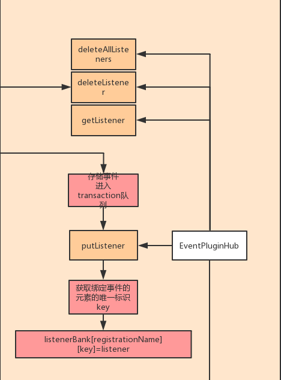
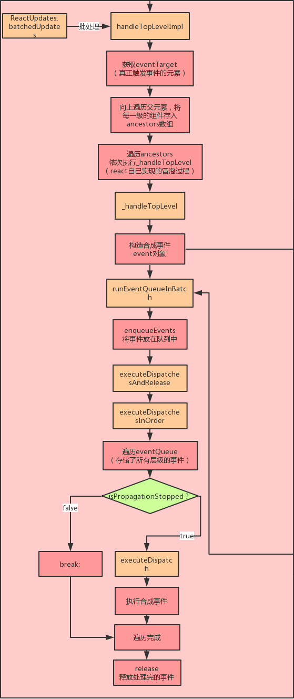
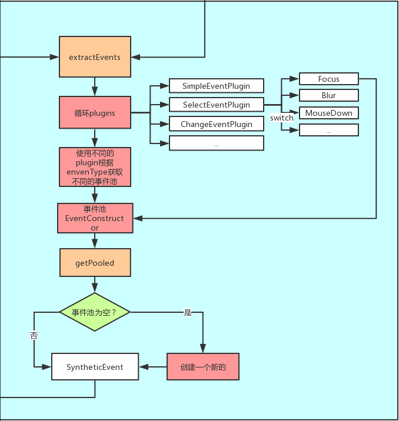
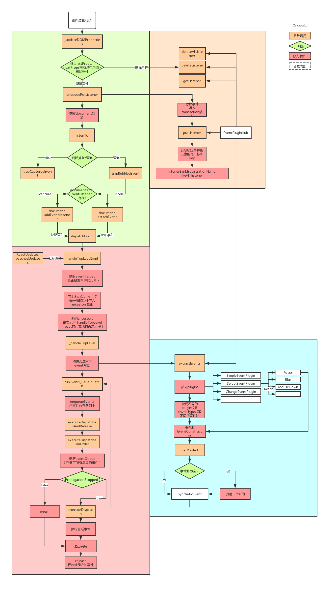

# React 事件绑定原理

1. 事件注册
   
   

   - 组件装载 / 更新。
   - 通过 lastProps、nextProps 判断是否新增、删除事件分别调用事件注册、卸载方法。
   - 调用 EventPluginHub 的 enqueuePutListener 进行事件存储
   - 获取 document 对象。
   - 根据事件名称（如 onClick、onCaptureClick）判断是进行冒泡还是捕获。
   - 判断是否存在 addEventListener 方法，否则使用 attachEvent（兼容 IE）。
   - 给 document 注册原生事件回调为 dispatchEvent（统一的事件分发机制）。

2. 事件存储
   
   

   - EventPluginHub 负责管理 React 合成事件的 callback，它将 callback 存储在 listenerBank 中，另外还存储了负责合成事件的 Plugin。
   - EventPluginHub 的 putListener 方法是向存储容器中增加一个 listener。
   - 获取绑定事件的元素的唯一标识 key。
   - 将 callback 根据事件类型，元素的唯一标识 key 存储在 listenerBank 中。
   - listenerBank 的结构是：listenerBank[registrationName][key]。

3. 事件触发执行
4. 
   

   - 触发 document 注册原生事件的回调 dispatchEvent
   - 获取到触发这个事件最深一级的元素
     这里的事件执行利用了 React 的批处理机制
     代码示例

     ```JavaScript
        <div onClick={this.parentClick} ref={ref => this.parent = ref}>
            <div onClick={this.childClick} ref={ref => this.child = ref}>
                test
          </div>
      </div>
     ```

     - 首先会获取到 this.child
     - 遍历这个元素的所有父元素，依次对每一级元素进行处理。
     - 构造合成事件。
     - 将每一级的合成事件存储在 eventQueue 事件队列中。
     - 遍历 eventQueue。
     - 通过 isPropagationStopped 判断当前事件是否执行了阻止冒泡方法。
     - 如果阻止了冒泡，停止遍历，否则通过 executeDispatch 执行合成事件。
     - 释放处理完成的事件。

5. 合成事件
   
   

   - 调用 EventPluginHub 的 extractEvents 方法。
   - 循环所有类型的 EventPlugin（用来处理不同事件的工具方法）。
   - 在每个 EventPlugin 中根据不同的事件类型，返回不同的事件池。
   - 在事件池中取出合成事件，如果事件池是空的，那么创建一个新的。
   - 根据元素 nodeid(唯一标识 key)和事件类型从 listenerBink 中取出回调函数
   - 返回带有合成事件参数的回调函数

6. 总流程
   
  
  
