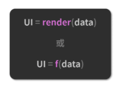

React-Hooks 设计动机与工作模式
===
### React-Hooks 设计动机初探
React-Hooks 这个东西比较特别，它是 React 团队在真刀真枪的 React 组件开发实践中，逐渐认知到的一个改进点，这背后其实涉及对类组件和函数组件两种组件形式的思考和侧重。因此，你首先得知道，什么是类组件、什么是函数组件，并完成对这两种组件形式的辨析。

#### 何谓类组件（Class Component）
  所谓类组件，就是基于 ES6 Class 这种写法，通过继承 React.Component 得来的 React 组件。以下是一个典型的类组件：
  ```JavaScript
    class DemoClass extends React.Component {
      // 初始化类组件的 state
      state = {
        text: ""
      };
      // 编写生命周期方法 didMount
      componentDidMount() {
        // 省略业务逻辑
      }
      // 编写自定义的实例方法
      changeText = (newText) => {
        // 更新 state
        this.setState({
          text: newText
        });
      };
      // 编写生命周期方法 render
      render() {
        return (
          <div className="demoClass">
            <p>{this.state.text}</p>
            <button onClick={this.changeText}>点我修改</button>
          </div>
        );
      }
    }
  ```
  #### 何谓函数组件/无状态组件（Function Component/Stateless Component）
  函数组件顾名思义，就是以函数的形态存在的 React 组件。早期并没有 React-Hooks 的加持，函数组件内部无法定义和维护 state，因此它还有一个别名叫“无状态组件”。以下是一个典型的函数组件：
  ```JavaScript
    function DemoFunction(props) {
      const { text } = props
      return (
        <div className="demoFunction">
          <p>{`function 组件所接收到的来自外界的文本内容是：[${text}]`}</p>
        </div>
      );
    }
  ```
### 重新理解类组件：包裹在面向对象思想下的“重装战舰”
类组件是面向对象编程思想的一种表征。面向对象是一个老生常谈的概念了，当我们应用面向对象的时候，总是会有意或无意地做这样两件事情。
  1. 封装：将一类属性和方法，“聚拢”到一个 Class 里去。
  2. 继承：新的 Class 可以通过继承现有 Class，实现对某一类属性和方法的复用。
React 类组件，也有同样的问题——它提供了多少东西，你就需要学多少东西。假如背不住生命周期，你的组件逻辑顺序大概率会变成一团糟。__“大而全”的背后，是不可忽视的学习成本__。
  更要命的是，由于开发者编写的逻辑在封装后是和组件粘在一起的，这就使得类**组件内部的逻辑难以实现拆分和复用。**如果你想要打破这个僵局，则需要进一步学习更加复杂的设计模式（比如高阶组件、Render Props 等），用更高的学习成本来交换一点点编码的灵活度。
  这一切的一切，光是想想就让人头秃。所以说，类组件固然强大， 但它绝非万能。
  #### 深入理解函数组件：呼应 React 设计思想的“轻巧快艇”
  相比于类组件，函数组件肉眼可见的特质自然包括轻量、灵活、易于组织和维护、较低的学习成本等。这些要素毫无疑问是重要的，它们也确实驱动着 React 团队做出改变。但是除此之外，还有一个非常容易被大家忽视、也极少有人能真正理解到的知识点，我在这里要着重讲一下。这个知识点缘起于 React 作者 Dan 早期特意为类组件和函数组件写过的[一篇非常棒的对比文章](https://overreacted.io/how-are-function-components-different-from-classes/)，这篇文章很长，但是通篇都在论证这一句话：
    <pre>__函数组件会捕获 render 内部的状态，这是两类组件最大的不同。__</pre>
说得更具体一点，__函数组件更加契合 React 框架的设计理念__。何出此言？不要忘了这个赫赫有名的 React 公式：

不夸张地说，__React 组件本身的定位就是函数__，一个吃进数据、吐出 UI 的函数。作为开发者，我们编写的是声明式的代码，而 React 框架的主要工作，就是__及时地把声明式的代码转换为命令式的 DOM 操作，把数据层面的描述映射到用户可见的 UI 变化中去__。这就意味着从原则上来讲，__React 的数据应该总是紧紧地和渲染绑定在一起的，而类组件做不到这一点。__
### Hooks 的本质：一套能够使函数组件更强大、更灵活的“钩子”
React-Hooks 是什么？它是一套能够使函数组件更强大、更灵活的“钩子”。

前面我们已经说过，函数组件比起类组件“少”了很多东西，比如生命周期、对 state 的管理等。这就给函数组件的使用带来了非常多的局限性，导致我们并不能使用函数这种形式，写出一个真正的全功能的组件。

React-Hooks 的出现，就是为了帮助函数组件补齐这些（相对于类组件来说）缺失的能力。

如果说函数组件是一台轻巧的快艇，那么 React-Hooks 就是一个内容丰富的零部件箱。“重装战舰”所预置的那些设备，这个箱子里基本全都有，同时它还不强制你全都要，而是允许你自由地选择和使用你需要的那些能力，然后将这些能力以 Hook（钩子）的形式“钩”进你的组件里，从而定制出一个最适合你的“专属战舰”。