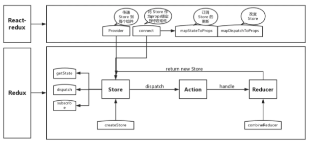

react-redux是如何工作的?
===
1. Provider: Provider的作用是从最外部封装了整个应用，并向connect模块传递store
2. connect: 负责连接React和Redux
   * 获取state: connect通过context获取Provider中的store，通过store.getState()获取整个store tree 上所有state
   * 包装原组件: 将state和action通过props的方式传入到原组件内部wrapWithConnect返回一个ReactComponent对象Connect，Connect重新render外部传入的原组件WrappedComponent，并把connect中传入的mapStateToProps, mapDispatchToProps与组件上原有的props合并后，通过属性的方式传给WrappedComponent
   * 监听store tree变化: connect缓存了store tree中state的状态,通过当前state状态和变更前state状态进行比较,从而确定是否调用this.setState()方法触发Connect及其子组件的重新渲染
