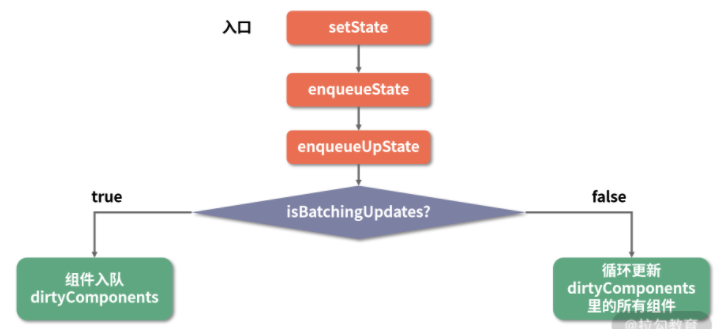

setState 到底是同步的，还是异步的？
===
### 异步的动机和原理——批量更新的艺术

在实际的 React 运行时中，setState 异步的实现方式有点类似于 Vue 的 $nextTick 和浏览器里的 Event-Loop：每来一个 setState，就把它塞进一个队列里“攒起来”。等时机成熟，再把“攒起来”的 state 结果做合并，最后只针对最新的 state 值走一次更新流程。这个过程，叫作“批量更新”，批量更新的过程正如下面代码中的箭头流程图所示：
```JavaScript
this.setState({
  count: this.state.count + 1    ===>    入队，[count+1的任务]
});
this.setState({
  count: this.state.count + 1    ===>    入队，[count+1的任务，count+1的任务]
});
this.setState({
  count: this.state.count + 1    ===>    入队, [count+1的任务，count+1的任务, count+1的任务]
});
                                          ↓
                                         合并 state，[count+3的任务]
                                          ↓
                                         执行 count+3的任务
```
值得注意的是，只要我们的同步代码还在执行，“攒起来”这个动作就不会停止。
### “同步现象”背后的故事：从源码角度看 setState 工作流
这里我先给出一个结论：__并不是 setTimeout 改变了 setState，而是 setTimeout 帮助 setState “逃脱”了 React 对它的管控。只要是在 React 管控下的 setState，一定是异步的。__
> tips：时下虽然市场里的 React 16、React 17 十分火热，但就 setState 这块知识来说，React 15 仍然是最佳的学习素材。因此下文所有涉及源码的分析，都会围绕 React 15 展开。关于 React 16 之后 Fiber 机制给 setState 带来的改变，我们会有专门一讲来分析，不在本讲的讨论范围内。
### 解读 setState 工作流



接下来我们就沿着这个流程，逐个在源码中对号入座。首先是 setState 入口函数：
```JavaScript
ReactComponent.prototype.setState = function (partialState, callback) {
  this.updater.enqueueSetState(this, partialState);
  if (callback) {
    this.updater.enqueueCallback(this, callback, 'setState');
  }
};
```
入口函数在这里就是充当一个分发器的角色，根据入参的不同，将其分发到不同的功能函数中去。这里我们以对象形式的入参为例，可以看到它直接调用了 this.updater.enqueueSetState 这个方法：
```JavaScript
enqueueSetState: function (publicInstance, partialState) {
  // 根据 this 拿到对应的组件实例
  var internalInstance = getInternalInstanceReadyForUpdate(publicInstance, 'setState');
  // 这个 queue 对应的就是一个组件实例的 state 数组
  var queue = internalInstance._pendingStateQueue || (internalInstance._pendingStateQueue = []);
  queue.push(partialState);
  //  enqueueUpdate 用来处理当前的组件实例
  enqueueUpdate(internalInstance);
}
```
这里我总结一下，enqueueSetState 做了两件事：
* 将新的 state 放进组件的状态队列里；
* 用 enqueueUpdate 来处理将要更新的实例对象。
继续往下走，看看 enqueueUpdate 做了什么：
```JavaScript
function enqueueUpdate(component) {
  ensureInjected();
  // 注意这一句是问题的关键，isBatchingUpdates标识着当前是否处于批量创建/更新组件的阶段
  if (!batchingStrategy.isBatchingUpdates) {
    // 若当前没有处于批量创建/更新组件的阶段，则立即更新组件
    batchingStrategy.batchedUpdates(enqueueUpdate, component);
    return;
  }
  // 否则，先把组件塞入 dirtyComponents 队列里，让它“再等等”
  dirtyComponents.push(component);
  if (component._updateBatchNumber == null) {
    component._updateBatchNumber = updateBatchNumber + 1;
  }
}
```
这个 enqueueUpdate 非常有嚼头，它引出了一个关键的对象——batchingStrategy，该对象所具备的isBatchingUpdates属性直接决定了当下是要走更新流程，还是应该排队等待；其中的batchedUpdates 方法更是能够直接发起更新流程。由此我们可以大胆推测，__batchingStrategy 或许正是 React 内部专门用于管控批量更新的对象。__
接下来，我们就一起来研究研究这个 batchingStrategy。
```JavaScript
/**
 * batchingStrategy源码
**/
var ReactDefaultBatchingStrategy = {
  // 全局唯一的锁标识
  isBatchingUpdates: false,
  // 发起更新动作的方法
  batchedUpdates: function(callback, a, b, c, d, e) {
    // 缓存锁变量
    var alreadyBatchingStrategy = ReactDefaultBatchingStrategy. isBatchingUpdates
    // 把锁“锁上”
    ReactDefaultBatchingStrategy. isBatchingUpdates = true
    if (alreadyBatchingStrategy) {
      callback(a, b, c, d, e)
    } else {
      // 启动事务，将 callback 放进事务里执行
      transaction.perform(callback, null, a, b, c, d, e)
    }
  }
}
```
batchingStrategy 对象并不复杂，你可以理解为它是一个“锁管理器”。
这里的“锁”，是指 React 全局唯一的 isBatchingUpdates 变量，isBatchingUpdates 的初始值是 false，意味着“当前并未进行任何批量更新操作”。每当 React 调用 batchedUpdate 去执行更新动作时，会先把这个锁给“锁上”（置为 true），表明“现在正处于批量更新过程中”。当锁被“锁上”的时候，任何需要更新的组件都只能暂时进入 dirtyComponents 里排队等候下一次的批量更新，而不能随意“插队”。此处体现的“任务锁”的思想，是 React 面对大量状态仍然能够实现有序分批处理的基石。

理解了批量更新整体的管理机制，还需要注意 batchedUpdates 中，有一个引人注目的调用
```javaScript
transaction.perform(callback, null, a, b, c, d, e)
```

这行代码为我们引出了一个更为硬核的概念——React 中的 Transaction（事务）机制。

### 理解 React 中的 Transaction（事务） 机制

Transaction 在 React 源码中的分布可以说非常广泛。如果你在 Debug React 项目的过程中，发现函数调用栈中出现了 initialize、perform、close、closeAll 或者 notifyAll 这样的方法名，那么很可能你当前就处于一个 Trasaction 中。

Transaction 在 React 源码中表现为一个核心类，React 官方曾经这样描述它：__Transaction 是创建一个黑盒__，该黑盒能够封装任何的方法。因此，那些需要在函数运行前、后运行的方法可以通过此方法封装（即使函数运行中有异常抛出，这些固定的方法仍可运行），实例化 Transaction 时只需提供相关的方法即可。
这段话初读有点拗口，这里我推荐你结合 React 源码中的一段针对 Transaction 的注释来理解它：
```JavaScript
* <pre>

 *                       wrappers (injected at creation time)

 *                                      +        +

 *                                      |        |

 *                    +-----------------|--------|--------------+

 *                    |                 v        |              |

 *                    |      +---------------+   |              |

 *                    |   +--|    wrapper1   |---|----+         |

 *                    |   |  +---------------+   v    |         |

 *                    |   |          +-------------+  |         |

 *                    |   |     +----|   wrapper2  |--------+   |

 *                    |   |     |    +-------------+  |     |   |

 *                    |   |     |                     |     |   |

 *                    |   v     v                     v     v   | wrapper

 *                    | +---+ +---+   +---------+   +---+ +---+ | invariants

 * perform(anyMethod) | |   | |   |   |         |   |   | |   | | maintained

 * +----------------->|-|---|-|---|-->|anyMethod|---|---|-|---|-|-------->

 *                    | |   | |   |   |         |   |   | |   | |

 *                    | |   | |   |   |         |   |   | |   | |

 *                    | |   | |   |   |         |   |   | |   | |

 *                    | +---+ +---+   +---------+   +---+ +---+ |

 *                    |  initialize                    close    |

 *                    +-----------------------------------------+

 * </pre>

```
说白了，Transaction 就像是一个“壳子”，它首先会将目标函数用 wrapper（一组 initialize 及 close 方法称为一个 wrapper） 封装起来，同时需要使用 Transaction 类暴露的 perform 方法去执行它。如上面的注释所示，在 anyMethod 执行之前，perform 会先执行所有 wrapper 的 initialize 方法，执行完后，再执行所有 wrapper 的 close 方法。这就是 React 中的事务机制。

### “同步现象”的本质
下面结合对事务机制的理解，我们继续来看在 ReactDefaultBatchingStrategy 这个对象。ReactDefaultBatchingStrategy 其实就是一个批量更新策略事务，它的 wrapper 有两个：FLUSH_BATCHED_UPDATES 和 RESET_BATCHED_UPDATES。

```JavaScript
var RESET_BATCHED_UPDATES = {
  initialize: emptyFunction,
  close: function () {
    ReactDefaultBatchingStrategy.isBatchingUpdates = false;
  }
};
var FLUSH_BATCHED_UPDATES = {
  initialize: emptyFunction,
  close: ReactUpdates.flushBatchedUpdates.bind(ReactUpdates)
};
```
我们把这两个 wrapper 套进 Transaction 的执行机制里，不难得出一个这样的流程：
在 callback 执行完之后，RESET_BATCHED_UPDATES 将 isBatchingUpdates 置为 false , FLUSH_BATCHED_UPDATES 执行 flushBatchedUpdates，然后里面会循环所有 dirtyComponent，调用 updateComponent 来执行所有的生命周期方法（componentWillReceiveProps → shouldComponentUpdate → componentWillUpdate → render → componentDidUpdate），最后实现组件的更新。

到这里，相信你对 isBatchingUpdates 管控下的批量更新机制已经了然于胸。但是 setState 为何会表现同步这个问题，似乎还是没有从当前展示出来的源码里得到根本上的回答。这是因为 batchingUpdates 这个方法，不仅仅会在 setState 之后才被调用。若我们在 React 源码中全局搜索 batchingUpdates，会发现调用它的地方很多，但与更新流有关的只有这两个地方：

```JavaScript
// ReactMount.js
_renderNewRootComponent: function( nextElement, container, shouldReuseMarkup, context ) {
  // 实例化组件
  var componentInstance = instantiateReactComponent(nextElement);
  // 初始渲染直接调用 batchedUpdates 进行同步渲染
  ReactUpdates.batchedUpdates(
    batchedMountComponentIntoNode,
    componentInstance,
    container,
    shouldReuseMarkup,
    context
  );
  ...
}
```

这段代码是在首次渲染组件时会执行的一个方法，我们看到它内部调用了一次 batchedUpdates，这是因为在组件的渲染过程中，会按照顺序调用各个生命周期函数。开发者很有可能在声明周期函数中调用 setState。因此，我们需要通过开启 batch 来确保所有的更新都能够进入 dirtyComponents 里去，进而确保初始渲染流程中所有的 setState 都是生效的。

下面代码是 React 事件系统的一部分。当我们在组件上绑定了事件之后，事件中也有可能会触发 setState。为了确保每一次 setState 都有效，React 同样会在此处手动开启批量更新。

```JavaScript
// ReactEventListener.js
dispatchEvent: function (topLevelType, nativeEvent) {
  ...
  try {
    // 处理事件
    ReactUpdates.batchedUpdates(handleTopLevelImpl, bookKeeping);
  } finally {
    TopLevelCallbackBookKeeping.release(bookKeeping);
  }
}
```

话说到这里，一切都变得明朗了起来：isBatchingUpdates 这个变量，在 React 的生命周期函数以及合成事件执行前，已经被 React 悄悄修改为了 true，这时我们所做的 setState 操作自然不会立即生效。当函数执行完毕后，事务的 close 方法会再把 isBatchingUpdates 改为 false。

### 总结
道理很简单，原理却很复杂。最后，我们再一次面对面回答一下标题提出的问题，对整个 setState 工作流做一个总结。
setState 并不是单纯同步/异步的，它的表现会因调用场景的不同而不同：在 React 钩子函数及合成事件中，它表现为异步；而在 setTimeout、setInterval 等函数中，包括在 DOM 原生事件中，它都表现为同步。这种差异，本质上是由 React 事务机制和批量更新机制的工作方式来决定的。

