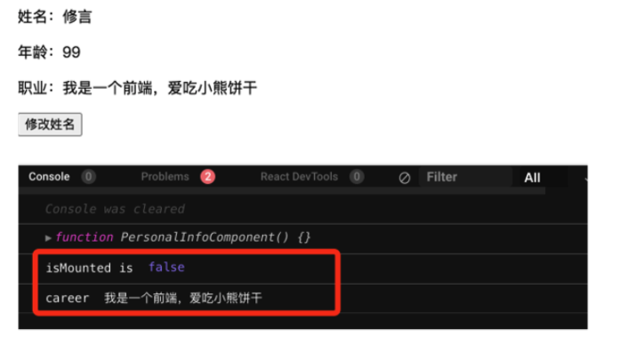
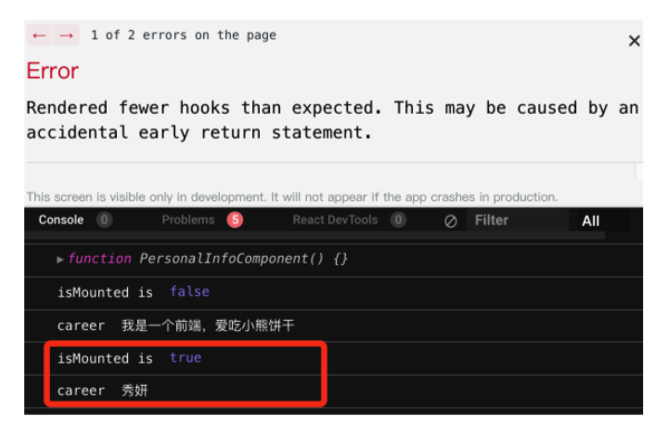
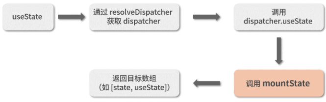
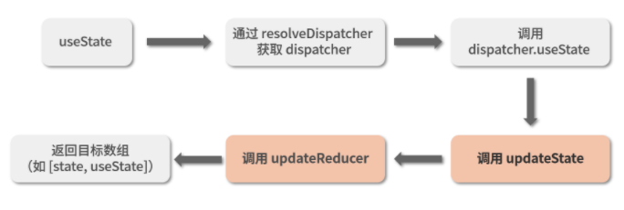
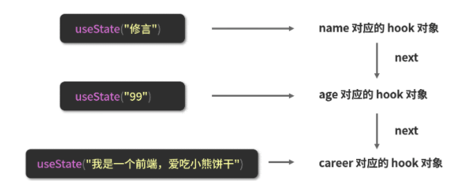
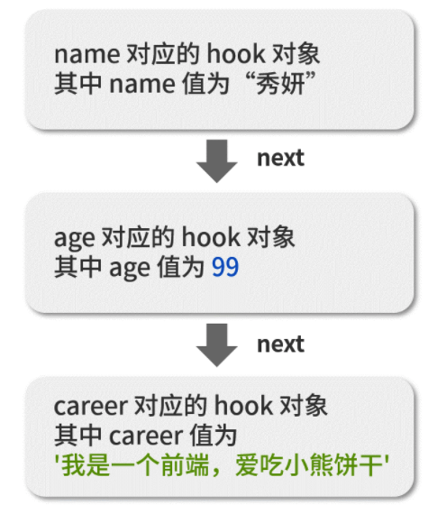

深入 React-Hooks 工作机制：“原则”的背后，是“原理”
===
React 团队面向开发者给出了两条 React-Hooks 的使用原则，原则的内容如下：
1. 只在 React 函数中调用 Hook；
2. 不要在循环、条件或嵌套函数中调用 Hook。
### 从现象看问题：若不保证 Hooks 执行顺序，会带来什么麻烦？
先来看一个小 Demo：
```JavaScript
import React, { useState } from "react";
// isMounted 用于记录是否已挂载（是否是首次渲染）
let isMounted = false;
function PersonalInfoComponent() {
  // 定义变量的逻辑不变
  let name, age, career, setName, setCareer;
  // 这里追加对 isMounted 的输出，这是一个 debug 性质的操作
  console.log("isMounted is", isMounted);
  // 这里追加 if 逻辑：只有在首次渲染（组件还未挂载）时，才获取 name、age 两个状态
  if (!isMounted) {
    // eslint-disable-next-line
    [name, setName] = useState("修言");
    // eslint-disable-next-line
    [age] = useState("99");
    // if 内部的逻辑执行一次后，就将 isMounted 置为 true（说明已挂载，后续都不再是首次渲染了）
    isMounted = true;
  }
  // 对职业信息的获取逻辑不变
  [career, setCareer] = useState("我是一个前端，爱吃小熊饼干");
  // 这里追加对 career 的输出，这也是一个 debug 性质的操作
  console.log("career", career);
  // UI 逻辑的改动在于，name和age成了可选的展示项，若值为空，则不展示
  return (
    <div className="personalInfo">
      {name ? <p>姓名：{name}</p> : null}
      {age ? <p>年龄：{age}</p> : null}
      <p>职业：{career}</p>
      <button
        onClick={() => {
          setName("秀妍");
        }}
      >
        修改姓名
      </button>
    </div>
  );
}
export default PersonalInfoComponent;
```
这个 PersonalInfoComponent 组件渲染出来的界面长这样：

注意，你在自己电脑上模仿这段代码的时候，千万不要漏掉 if 语句里面// eslint-disable-next-line这个注释——因为目前大部分的 React 项目都在内部预置了对 React-Hooks-Rule（React-Hooks 使用规则）的强校验，而示例代码中把 Hooks 放进 if 语句的操作作为一种不合规操作，会被直接识别为 Error 级别的错误，进而导致程序报错。这里我们只有将相关代码的 eslint 校验给禁用掉，才能够避免校验性质的报错，从而更直观地看到错误的效果到底是什么样的，进而理解错误的原因。

修改后的组件在初始挂载的时候，实际执行的逻辑内容和上个版本是没有区别的，都涉及对 name、age、career 三个状态的获取和渲染。理论上来说，__变化应该发生在我单击“修改姓名”之后触发的二次渲染里__：二次渲染时，isMounted 已经被置为 true，if 内部的逻辑会被直接跳过。此时按照代码注释中给出的设计意图，这里我希望在二次渲染时，只获取并展示 career 这一个状态。那么事情是否会如我所愿呢？我们一起来看看单击“修改姓名”按钮后会发生什么：

组件不仅没有像预期中一样发生界面变化，甚至直接报错了。报错信息提醒我们，这是因为 __“组件渲染的 Hooks 比期望中更少”__。
按道理来说，二次渲染的时候，只要我获取到的 career 值没有问题，那么渲染就应该是没有问题的（因为二次渲染实际只会渲染 career 这一个状态），React 就没有理由阻止我的渲染动作。啊这……难道是 career 出问题了吗？还好我们预先留了一手 Debug 逻辑，每次渲染的时候都会尝试去输出一次 isMounted 和 career 这两个变量的值。现在我们就赶紧来看看，这两个变量到底是什么情况。

首先将界面重置回初次挂载的状态，观察控制台的输出，如下图所示：

这里我把关键的 isMounted 和 career 两个变量用红色框框圈了出来：isMounted 值为 false，说明是初次渲染；career 值为“我是一个前端，爱吃小熊饼干”，这也是没有问题的。

接下来单击“修改姓名”按钮后，我们再来看一眼两个变量的内容，如下图所示：

二次渲染时，isMounted 为 true，这个没毛病。但是 career 竟然被修改为了“秀妍”，这也太诡异了？代码里面可不是这么写的。赶紧回头确认一下按钮单击事件的回调内容，代码如下所示：
```JavaScript
 <button
   onClick={() => {
    setName("秀妍");
  }}
   >
  修改姓名
</button>
```
确实，代码是没错的，我们调用的是 setName，那么它修改的状态也应该是 name，而不是 career。
那为什么最后发生变化的竟然是 career 呢？不如我们一起来看一看 Hooks 的实现机制吧！

### 以 useState 为例，分析 React-Hooks 的调用链路
首先要说明的是，React-Hooks 的调用链路在首次渲染和更新阶段是不同的，这里我将两个阶段的链路各总结进了两张大图里，我们依次来看。首先是首次渲染的过程，请看下图

在这个流程中，useState 触发的一系列操作最后会落到 mountState 里面去，所以我们重点需要关注的就是 mountState 做了什么事情。以下是 mountState 的源码：
```JavaScript
// 进入 mounState 逻辑
function mountState(initialState) {
  // 将新的 hook 对象追加进链表尾部
  var hook = mountWorkInProgressHook();
  // initialState 可以是一个回调，若是回调，则取回调执行后的值
  if (typeof initialState === 'function') {
    // $FlowFixMe: Flow doesn't like mixed types
    initialState = initialState();
  }
  // 创建当前 hook 对象的更新队列，这一步主要是为了能够依序保留 dispatch
  const queue = hook.queue = {
    last: null,
    dispatch: null,
    lastRenderedReducer: basicStateReducer,
    lastRenderedState: (initialState: any),
  };
  // 将 initialState 作为一个“记忆值”存下来
  hook.memoizedState = hook.baseState = initialState;
  // dispatch 是由上下文中一个叫 dispatchAction 的方法创建的，这里不必纠结这个方法具体做了什么
  var dispatch = queue.dispatch = dispatchAction.bind(null, currentlyRenderingFiber$1, queue);
  // 返回目标数组，dispatch 其实就是示例中常常见到的 setXXX 这个函数，想不到吧？哈哈
  return [hook.memoizedState, dispatch];
}
```
从这段源码中我们可以看出，__mounState 的主要工作是初始化 Hooks__。在整段源码中，最需要关注的是 mountWorkInProgressHook 方法，它为我们道出了 Hooks 背后的数据结构组织形式。以下是 mountWorkInProgressHook 方法的源码：
```JavaScript
function mountWorkInProgressHook() {
  // 注意，单个 hook 是以对象的形式存在的
  var hook = {
    memoizedState: null,
    baseState: null,
    baseQueue: null,
    queue: null,
    next: null
  };
  if (workInProgressHook === null) {
    // 这行代码每个 React 版本不太一样，但做的都是同一件事：将 hook 作为链表的头节点处理
    firstWorkInProgressHook = workInProgressHook = hook;
  } else {
    // 若链表不为空，则将 hook 追加到链表尾部
    workInProgressHook = workInProgressHook.next = hook;
  }
  // 返回当前的 hook
  return workInProgressHook;
}
```
到这里可以看出，__hook 相关的所有信息收敛在一个 hook 对象里，而 hook 对象之间以单向链表的形式相互串联__。
接下来我们再看更新过程的大图：

根据图中高亮部分的提示不难看出，首次渲染和更新渲染的区别，在于调用的是 mountState，还是 updateState。mountState 做了什么，你已经非常清楚了；而 updateState 之后的操作链路，虽然涉及的代码有很多，但其实做的事情很容易理解：__按顺序去遍历之前构建好的链表，取出对应的数据信息进行渲染。__
我们把 mountState 和 updateState 做的事情放在一起来看：mountState（首次渲染）构建链表并渲染；updateState 依次遍历链表并渲染。
看到这里，你是不是已经大概知道怎么回事儿了？没错，__hooks 的渲染是通过“依次遍历”来定位每个 hooks 内容的。如果前后两次读到的链表在顺序上出现差异，那么渲染的结果自然是不可控的。__

接下来我们把这个已知的结论还原到 PersonalInfoComponent 里去，看看实际项目中，变量到底是怎么发生变化的。
__站在底层视角，重现 PersonalInfoComponent 组件的执行过程__
我们先来复习一下修改过后的 PersonalInfoComponent 组件代码：
```JavaScript
import React, { useState } from "react";
// isMounted 用于记录是否已挂载（是否是首次渲染）
let isMounted = false;
function PersonalInfoComponent() {
  // 定义变量的逻辑不变
  let name, age, career, setName, setCareer;
  // 这里追加对 isMounted 的输出，这是一个 debug 性质的操作
  console.log("isMounted is", isMounted);
  // 这里追加 if 逻辑：只有在首次渲染（组件还未挂载）时，才获取 name、age 两个状态
  if (!isMounted) {
    // eslint-disable-next-line
    [name, setName] = useState("修言");
    // eslint-disable-next-line
    [age] = useState("99");
    // if 内部的逻辑执行一次后，就将 isMounted 置为 true（说明已挂载，后续都不再是首次渲染了）
    isMounted = true;
  }
  // 对职业信息的获取逻辑不变
  [career, setCareer] = useState("我是一个前端，爱吃小熊饼干");
  // 这里追加对 career 的输出，这也是一个 debug 性质的操作
  console.log("career", career);
  // UI 逻辑的改动在于，name 和 age 成了可选的展示项，若值为空，则不展示
  return (
    <div className="personalInfo">
      {name ? <p>姓名：{name}</p> : null}
      {age ? <p>年龄：{age}</p> : null}
      <p>职业：{career}</p>
      <button
        onClick={() => {
          setName("秀妍");
        }}
      >
        修改姓名
      </button>
    </div>
  );
}
export default PersonalInfoComponent;
```
从代码里面，我们可以提取出来的 useState 调用有三个：
```JavaScript
[name, setName] = useState("修言");
[age] = useState("99");
[career, setCareer] = useState("我是一个前端，爱吃小熊饼干");
```
这三个调用在首次渲染的时候都会发生，伴随而来的链表结构如图所示：

当首次渲染结束，进行二次渲染的时候，实际发生的 useState 调用只有一个：
```JavaScript
  useState("我是一个前端，爱吃小熊饼干")
```
而此时的链表情况如下图所示：

我们再复习一遍更新（二次渲染）的时候会发生什么事情：updateState 会依次遍历链表、读取数据并渲染。注意这个过程就像从数组中依次取值一样，是完全按照顺序（或者说索引）来的。因此 React 不会看你命名的变量名是 career 还是别的什么，它只认你这一次 useState 调用，于是它难免会认为：喔，原来你想要的是第一个位置的 hook 啊。
然后就会有下面这样的效果：

