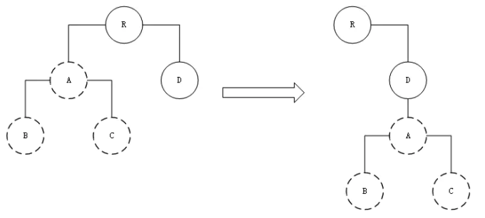
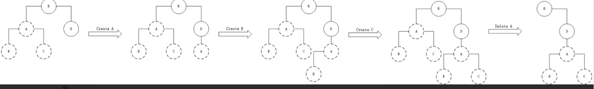
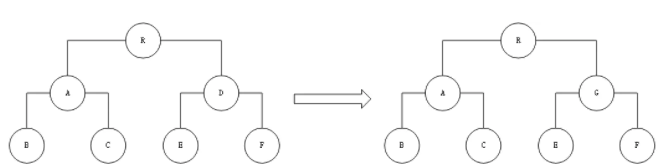
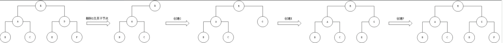
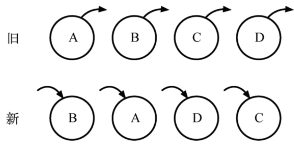
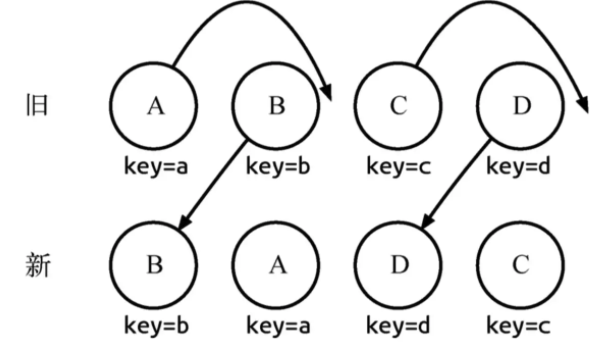
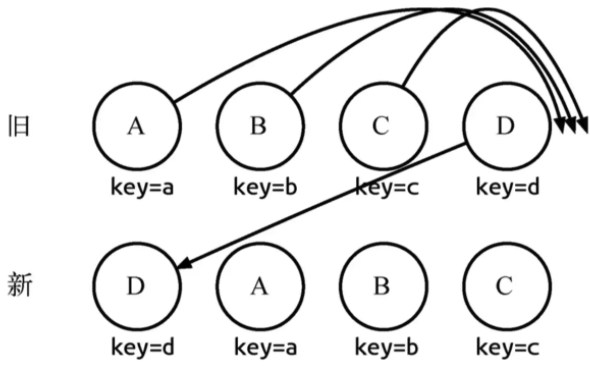

解析React Diff 算法
===
### Diff 的作用
React Diff 会帮助我们计算出 Virtual DOM 中真正发生变化的部分，并且只针对该部分进行实际的DOM操作，而不是对整个页面进行重新渲染
### 传统diff算法的问题
传统的diff算法是使用循环递归对节点进行依次对比，复杂度为O(n^3),效率低下。

### React diff算法策略
* 针对树结构(tree diff)：对UI层的DOM节点跨层级的操作进行忽略。（数量少）
* 针对组件结构(component diff)：拥有相同类的两个组件生成相似的树形结构，拥有不同类的两个组件会生成不同的属性结构
* 针对元素结构(element-diff): 对于同一层级的一组节点，使用具有唯一性的id区分 (key属性)

#### tree diff 的特点
* React 通过使用 updateDepth 对 虚拟DOM树进行层次遍历
* 两棵树只对同一层级节点进行比较，只要该节点不存在了，那么该节点与其所有子节点会被完全删除,不在进行进一步比较。
* 只需要遍历一次，便完成对整个DOM树的比较。

tree diff的前提是Web UI中DOM节点跨层级的移动操作特别少，但并没有否定DOM节点跨层级的操作的存在，那么当遇到这种操作时，React是如何处理的呢？

接下来我们通过一张图来展示整个处理过程：

A 节点(包括其子节点)整个被移动到 D 节点下，由于 React 只会简单地考虑同层级节点的位置变换，而对于不 同层级的节点，只有创建和删除操作。当根节点发现子节点中 A 消失了，就会直接销毁 A;当 D 发现多了一个子节点 A，则会创 建新的 A(包括子节点)作为其子节点。此时，diff 的执行情况:create A → create B → create C → delete A。
由此可以发现，当出现节点跨层级移动时，并不会出现想象中的移动操作，而是以 A 为根节点的整个树被重新创建。这是一种影响React性能的操作，因此官方建议不要进行 DOM 节点跨层级的操作。
<pre><code>React diff 只考虑同层次的节点位置变换,若为跨层级的位置变化，则是创建节点和删除节点的操作。即在新位置上重新创建相同的节点，而删除原位置的节点。</code></pre>
#### component diff的特点
* 如果是同一类型的组件，按照原策略继续比较 Virtual DOM 树即可。
* 如果不是，则将该组件判断为 dirty component，从而替换整个组件下的所有子节点。
* 对于同一类型的组件，有可能其 Virtual DOM 没有任何变化，如果能够确切知道这点，那么就可以节省大量的 diff 运算时间。因此，React允许用户通过shouldComponentUpdate()来判断该组件是否需进行diff算法分析，但是如果调用了forceUpdate方法，shouldComponentUpdate则失效。
接下来我们看下面这个例子是如何实现转换的：

转换流程如下：

当组件D变为组件G时，即使这两个组件结构相似，一旦React判断D和G是不同类型的组件，就不会比较二 者的结构，而是直接删除组件D，重新创建组件G及其子节点。虽然当两个组件是不同类型但结构相似时，diff会影响性能，但正如React官方博客所言:不同类型的组件很少存在相似DOM树的情况，因此这种极端因素很难在实际开发过程中造成重大的影响。

#### element diff
对于处于同一层级的节点，React diff 提供了三种节点操作: 插入，移动，删除

* 插入:  新的组件不在原来的集合中，而是全新的节点，则对集合进行插入操作。
* 删除:  组件已经在集合中，但集合已经更新，此时节点就需要删除
* 移动:  组件已经存在于集合中，并且集合更新时，组件并没有发生更新，只是位置发生改变，例如：(A,B,C,D) → (A,D,B,C), 如果为传统diff则会在检测到旧集合中第二位为B，新集合第二位为D时删除B，插入D，并且后面的所有节点都要重新加载，而 React diff 则是通过向同一层的节点添加 唯一key 进行区分，并且移动。

旧集合中包含节点A、B、C和D，更新后的新集合中包含节点B、A、D和C，此时新旧集合进行diff差异化对比，发现B!=A，则创建并插入B至新集合，删除旧集合A;以此类推，创建并插入A、D和C，删除B、C和D。

我们发现这些都是相同的节点，仅仅是位置发生了变化，但却需要进行繁杂低效的删除、创建操作，其实只要对这些节点进行位置移动即可。React针对这一现象提出了一种优化策略：允许开发者对同一层级的同组子节点，添加唯一 key 进行区分。 虽然只是小小的改动，性能上却发生了翻天覆地的变化!我们再来看一下应用了这个策略之后，react diff是如何操作的。

通过key可以准确地发现新旧集合中的节点都是相同的节点，因此无需进行节点删除和创建，只需要将旧集合中节点的位置进行移动，更新为新集合中节点的位置，此时React 给出的diff结果为:B、D不做任何操作，A、C进行移动操作即可。
具体的流程我们用一张表格来展现一下：

<code>
  <table>
<thead>
<tr>
<th>index</th>
<th style="text-align:left">节点</th>
<th style="text-align:left">oldIndex</th>
<th style="text-align:left">maxIndex</th>
<th style="text-align:left">操作</th>
</tr>
</thead>
<tbody>
<tr>
<td>0</td>
<td style="text-align:left">B</td>
<td style="text-align:left">1</td>
<td style="text-align:left">0</td>
<td style="text-align:left">oldIndex(1)&gt;maxIndex(0),maxIndex=oldIndex，maxIndex变为1</td>
</tr>
<tr>
<td>1</td>
<td style="text-align:left">A</td>
<td style="text-align:left">0</td>
<td style="text-align:left">1</td>
<td style="text-align:left">oldIndex(0)&lt;maxIndex(1),节点A移动至index(1)的位置</td>
</tr>
<tr>
<td>2</td>
<td style="text-align:left">D</td>
<td style="text-align:left">3</td>
<td style="text-align:left">1</td>
<td style="text-align:left">oldIndex(3)&gt;maxIndex(1),maxIndex=oldIndex，maxIndex变为3</td>
</tr>
<tr>
<td>3</td>
<td style="text-align:left">C</td>
<td style="text-align:left">2</td>
<td style="text-align:left">3</td>
<td style="text-align:left">oldIndex(2)&lt;maxIndex(3),节点C移动至index(3)的位置</td>
</tr>
</tbody>
</table>
</code>

* index： 新集合的遍历下标。
* oldIndex：当前节点在老集合中的下标。
* maxIndex：在新集合访问过的节点中，其在老集合的最大下标值。
操作一栏中只比较oldIndex和maxIndex：
* 当oldIndex>maxIndex时，将oldIndex的值赋值给maxIndex
* 当oldIndex=maxIndex时，不操作
* 当oldIndex<maxIndex时，将当前节点移动到index的位置
上面的例子仅仅是在新旧集合中的节点都是相同的节点的情况下，那如果新集合中有新加入的节点且旧集合存在 需要删除的节点，那么 diff 又是如何对比运作的呢?
<code>
  <table>
  <thead>
  <tr>
  <th>index</th>
  <th style="text-align:left">节点</th>
  <th style="text-align:left">oldIndex</th>
  <th style="text-align:left">maxIndex</th>
  <th style="text-align:left">操作</th>
  </tr>
  </thead>
  <tbody>
  <tr>
  <td>0</td>
  <td style="text-align:left">B</td>
  <td style="text-align:left">1</td>
  <td style="text-align:left">0</td>
  <td style="text-align:left">oldIndex(1)&gt;maxIndex(0)，maxIndex=oldIndex，maxIndex变为1</td>
  </tr>
  <tr>
  <td>1</td>
  <td style="text-align:left">E</td>
  <td style="text-align:left">-</td>
  <td style="text-align:left">1</td>
  <td style="text-align:left">oldIndex不存在，添加节点E至index(1)的位置</td>
  </tr>
  <tr>
  <td>2</td>
  <td style="text-align:left">C</td>
  <td style="text-align:left">2</td>
  <td style="text-align:left">1</td>
  <td style="text-align:left">oldIndex(2)&gt;maxIndex(1),maxIndex=oldIndex，maxIndex变为2</td>
  </tr>
  <tr>
  <td>3</td>
  <td style="text-align:left">A</td>
  <td style="text-align:left">0</td>
  <td style="text-align:left">2</td>
  <td style="text-align:left">oldIndex(0)&lt;maxIndex(2),节点A移动至index(3)的位置</td>
  </tr>
  </tbody>
  </table>
</code>

<pre>
  <code>
    注：最后还需要对旧集合进行循环遍历，找出新集合中没有的节点，此时发现存在这样的节点D，因此删除节点D，到此 diff 操作全部完成。
  </code>
</pre>

同样操作一栏中只比较oldIndex和maxIndex，但是oldIndex可能有不存在的情况：
* oldIndex存在
  1. 当oldIndex>maxIndex时，将oldIndex的值赋值给maxIndex
  2. 当oldIndex=maxIndex时，不操作
  3. 当oldIndex<maxIndex时，将当前节点移动到index的位置
* oldIndex不存在
  1. 新增当前节点至index的位置
   
   
当然这种diff并非完美无缺的，我们来看这么一种情况：

实际我们只需对D执行移动操作，然而由于D在旧集合中的位置是最大的，导致其他节点的oldIndex < maxIndex，造成D没有执行移动操作，而是A、B、C全部移动到D节点后面的现象。针对这种情况，官方建议：
<pre>
  <code>
    在开发过程中，尽量减少类似将最后一个节点移动到列表首部的操作。当节点数量过大或更新操作过于频繁时，这在一定程度上会影响React的渲染性能。
  </code>
</pre>

由于key的存在，react可以准确地判断出该节点在新集合中是否存在，这极大地提高了diff效率。我们在开发过中进行列表渲染的时候，若没有加key，react会抛出警告要求开发者加上key，就是为了提高diff效率。

虽然加了key提高了diff效率，但是未必一定提升了页面的性能。因此我们要注意这么一点：

<pre>对于简单列表页渲染来说，不加key要比加了key的性能更好</pre>

根据上面的情况，最后我们总结一下key的作用：
* 准确判断出当前节点是否在旧集合中
* 极大地减少遍历次数
