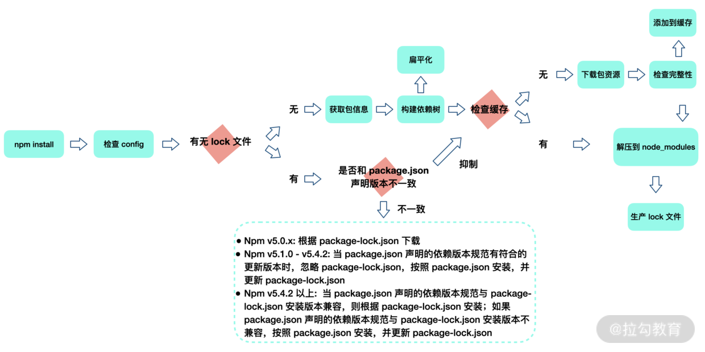
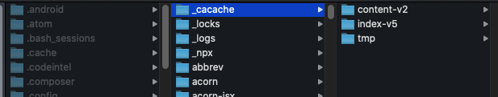
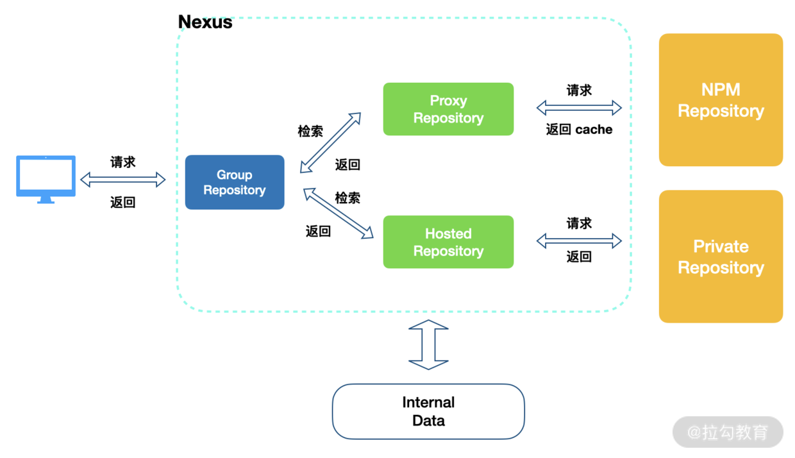

npm 安装机制及企业级部署私服原理
====

### npm 内部机制和核心原理

npm 的安装机制非常值得探究。Ruby 的 Gem、Python 的 pip 都是全局安装，但是 npm 的安装机制秉承了不同的设计哲学。

它会优先安装依赖包到当前项目目录，使得不同应用项目的依赖各成体系，同时还减轻了包作者的 API 兼容性压力，__但这样做的缺陷也很明显__：如果我们的项目 A 和项目 B，都依赖了相同的公共库 C，那么公共库 C 一般都会在项目 A 和项目 B 中，各被安装一次。这就说明，__同一个依赖包可能在我们的电脑上进行多次安装__。

当然，对于一些工具模块比如 supervisor 和 gulp，你仍然可以使用全局安装模式，这样方便注册 path 环境变量，我们可以在任何地方直接使用 supervisor、 gulp 这些命令。（不过，一般还是建议不同项目维护自己局部的 gulp 开发工具以适配不同项目需求。）

下面，言归正传，我们通过流程图来分析 npm install 的安装机制。



1. npm install 执行之后，首先，检查并获取 npm 配置，这里的优先级为：项目级的 .npmrc 文件 > 用户级的 .npmrc 文件> 全局级的 .npmrc 文件 > npm 内置的 .npmrc 文件。
2. 然后检查项目中是否有 package-lock.json 文件。
   
   如果有，则检查 package-lock.json 和 package.json 中声明的依赖是否一致：
   * 一致，直接使用 package-lock.json 中的信息，从缓存或网络资源中加载依赖；
   *  npm 版本进行处理（不同 npm 版本处理会有不同，具体处理方式如图所示）。
  
    如果没有，则根据 package.json 递归构建依赖树。
3. 然后按照构建好的依赖树下载完整的依赖资源，在下载时就会检查是否存在相关资源缓存：
    * 存在，则将缓存内容解压到 node_modules 中；
    * 否则就先从 npm 远程仓库下载包，校验包的完整性，并添加到缓存，同时解压到 node_modules。
4. 最后生成 package-lock.json。

构建依赖树时，当前依赖项目不管其是直接依赖还是子依赖的依赖，都应该按照扁平化原则，优先将其放置在 node_modules 根目录（最新版本 npm 规范）。在这个过程中，遇到相同模块就判断已放置在依赖树中的模块版本是否符合新模块的版本范围，如果符合则跳过；不符合则在当前模块的 node_modules 下放置该模块（最新版本 npm 规范）。

我给出的流程图中有标注更细节的内容，这里就不再赘述了。__你要格外注意图中标明的 npm 不同版本的不同处理情况，并学会从这种“历史问题”中总结 npm 使用的团队最佳实践：同一个项目团队，应该保证 npm 版本的一致。__

### npm 缓存机制

__对于一个依赖包的同一版本进行本地化缓存，是当代依赖包管理工具的一个常见设计__。使用时要先执行以下命令：

```JavaScript
npm config get cache
```

得到配置缓存的根目录在 /Users/用户名/.npm（ Mac OS 中，npm 默认的缓存位置） 当中。我们 cd 进入 /Users/cehou/.npm 中可以发现_cacache文件。事实上，在 npm v5 版本之后，缓存数据均放在根目录中的_cacache文件夹中。



我们可以使用以下命令清除 /Users/用户名/.npm/_cacache 中的文件：

```JavaScript
 npm cache clean --force
```

接下来打开_cacache文件，看看 npm 缓存了哪些东西，一共有 3 个目录：

* content-v2
* index-v5
* tmp

其中 content-v2 里面基本都是一些二进制文件。为了使这些二进制文件可读，我们把二进制文件的扩展名改为 .tgz，然后进行解压，得到的结果其实就是我们的 npm 包资源。

而 index-v5 文件中，我们采用跟刚刚一样的操作就可以获得一些描述性的文件，事实上这些内容就是 content-v2 里文件的索引。

#### 这些缓存如何被储存并被利用的呢？

这就和 npm install 机制联系在了一起。当 npm install 执行时，通过[pacote](https://www.npmjs.com/package/pacote)把相应的包解压在对应的 node_modules 下面。npm 在下载依赖时，先下载到缓存当中，再解压到项目 node_modules 下。pacote 依赖npm-registry-fetch来下载包，npm-registry-fetch 可以通过设置 cache 属性，在给定的路径下根据IETF RFC 7234生成缓存数据。

接着，在每次安装资源时，根据 package-lock.json 中存储的 integrity、version、name 信息生成一个唯一的 key，这个 key 能够对应到 index-v5 目录下的缓存记录。如果发现有缓存资源，就会找到 tar 包的 hash，根据 hash 再去找缓存的 tar 包，并再次通过pacote把对应的二进制文件解压到相应的项目 node_modules 下面，省去了网络下载资源的开销。

__注意，这里提到的缓存策略是从 npm v5 版本开始的。在 npm v5 版本之前，每个缓存的模块在 ~/.npm 文件夹中以模块名的形式直接存储，储存结构是：{cache}/{name}/{version}。__

### npm 多源镜像和企业级部署私服原理

__npm 中的源（registry），其实就是一个查询服务__。以 npmjs.org 为例，它的查询服务网址是 https://registry.npmjs.org/。这个网址后面跟上模块名，就会得到一个 JSON 对象，里面是该模块所有版本的信息。比如，访问 https://registry.npmjs.org/react，就会看到 react 模块所有版本的信息。

我们可以通过npm config set命令来设置安装源或者某个 scope 对应的安装源，很多企业也会搭建自己的 npm 源。我们常常会碰到需要使用多个安装源的项目，这时就可以通过 npm-preinstall 的钩子，通过 npm 脚本，在安装公共依赖前自动进行源切换：

```JavaScript
"scripts": {
    "preinstall": "node ./bin/preinstall.js"
}
```

其中 preinstall.js 脚本内容，具体逻辑为通过 node.js 执行npm config set命令，代码如下：

```JavaScript
require(' child_process').exec('npm config get registry', function(error, stdout, stderr) {
  if (!stdout.toString().match(/registry\.x\.com/)) {
    exec('npm config set @xscope:registry https://xxx.com/npm/')
  }
})
```

国内很多开发者使用的 nrm（npm registry manager）是 npm 的镜像源管理工具，使用它可以快速地在 npm 源间切换，这当然也是一种选择。

你的公司是否也正在部署一个私有 npm 镜像呢？你有没有想过公司为什么要这样做呢？

虽然 npm 并没有被屏蔽，但是下载第三方依赖包的速度依然较缓慢，这严重影响 CI/CD 流程或本地开发效率。部署镜像后，一般可以确保 __高速、稳定的 npm 服务__，__而且使发布私有模块更加安全__。除此之外，__审核机制也可以保障私服上的 npm 模块质量和安全__。

那么，如何部署一个私有 npm 镜像呢？

现在社区上主要有 3 种工具来搭建 npm 私服：nexus、verdaccio 以及 cnpm。

它们的工作原理相同，我们可以通过 nexus 的架构示例简单了解一下：



nexus 工作在 client 和外部 npm 之间，并通过 group repository 合并 npm 仓库以及私有仓库，这样就起到了代理转发的作用。

了解了 npm 私服的原理，我们就不畏惧任何“雷区”。这部分我也总结了两个社区上常见的问题。

#### npm 配置作用优先级

npm 可以通过默认配置帮助我们预设好 npm 对项目的影响动作，但是 npm 的配置优先级需要开发者确认了解。

如下图所示，优先级从左到右依次降低。我们在使用 npm 时需要了解 npm 的设置作用域，排除干扰范围，以免一顿骚操作之后，并没有找到相应的起作用配置。


#### npm 镜像和安装问题

另外一个常见的问题就是 npm 镜像和依赖安装，关于 npm 镜像和依赖安装问题，归根到底还是网络环境导致的，建议有条件的情况下还是从网络层面解决问题。

如果没有条件，也不要紧，办法总比困难多，可以通过设置安装源镜像来解决，这就需要紧跟社区方案，刨根究底了。这里推荐一篇文章：聊聊 [npm 镜像那些险象环生的坑](https://mp.weixin.qq.com/s/2ntKGIkR3Uiy9cQfITg2NQ)，文章中有更详细的内容，你可以看看。