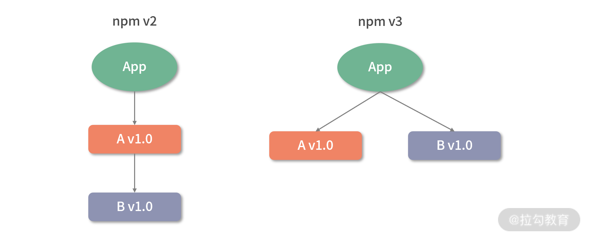
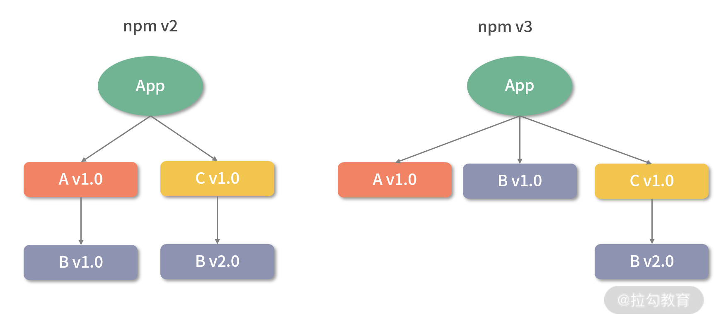
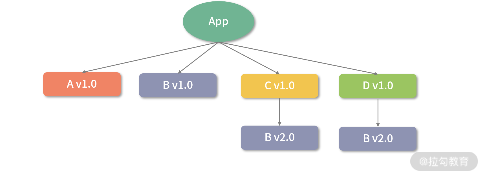
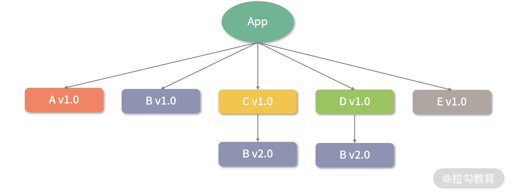
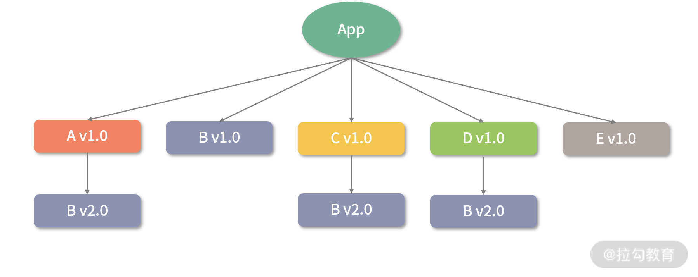
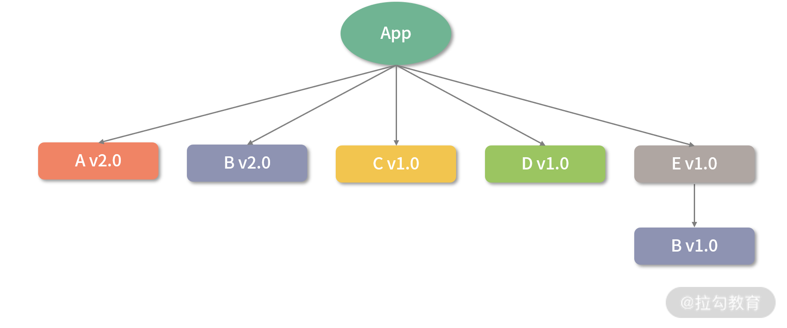

Yarn 的安装理念及如何破解依赖管理困境
====

当 npm 还处在 v3 时期时，一个叫作 Yarn 的包管理方案横空出世。2016 年，npm 还没有 package-lock.json 文件，安装速度很慢，稳定性也较差，而 Yarn 的理念很好地解决了以下问题。

* __确定性__：通过 yarn.lock 等机制，保证了确定性。即不管安装顺序如何，相同的依赖关系在任何机器和环境下，都可以以相同的方式被安装。（在 npm v5 之前，没有 package-lock.json 机制，只有默认并不会使用的npm-shrinkwrap.json。）
* __采用模块扁平安装模式__：将依赖包的不同版本，按照一定策略，归结为单个版本，以避免创建多个副本造成冗余（npm 目前也有相同的优化）。
* __网络性能更好__：Yarn 采用了请求排队的理念，类似并发连接池，能够更好地利用网络资源；同时引入了更好的安装失败时的重试机制。
* __采用缓存机制，实现了离线模式__（npm 目前也有类似实现）。

我们先来看看 yarn.lock 结构：
```JavaScript
"@babel/cli@^7.1.6", "@babel/cli@^7.5.5":
  version "7.8.4"
  resolved "http://npm.in.zhihu.com/@babel%2fcli/-/cli-7.8.4.tgz#505fb053721a98777b2b175323ea4f090b7d3c1c"
  integrity sha1-UF+wU3IamHd7KxdTI+pPCQt9PBw=
  dependencies:
    commander "^4.0.1"
    convert-source-map "^1.1.0"
    fs-readdir-recursive "^1.1.0"
    glob "^7.0.0"
    lodash "^4.17.13"
    make-dir "^2.1.0"
    slash "^2.0.0"
    source-map "^0.5.0"
  optionalDependencies:
    chokidar "^2.1.8"
```

该结构整体和 package-lock.json 结构类似，只不过 yarn.lock 并没有使用 JSON 格式，而是采用了一种自定义的标记格式，新的格式仍然保持了较高的可读性。

__相比 npm，Yarn 另外一个显著区别是 yarn.lock 中子依赖的版本号不是固定版本__。这就说明单独一个 yarn.lock 确定不了 node_modules 目录结构，还需要和 package.json 文件进行配合。

其实，不管是 npm 还是 Yarn，说到底它们都是一个包管理工具，在项目中如果想进行 npm/Yarn 切换，并不是一件麻烦的事情。__甚至还有一个专门的 synp 工具，它可以将 yarn.lock 转换为 package-lock.json__，反之亦然。

### Yarn 安装机制和背后思想

上一讲我们已经介绍过了 npm 安装机制，这里我们再来看一下 Yarn 的安装理念。简单来说，Yarn 的安装过程主要有以下 5 大步骤：
检测（checking）→ 解析包（Resolving Packages） → 获取包（Fetching Packages）→ 链接包（Linking Packages）→ 构建包（Building Packages）


#### 检测包（checking）

这一步主要是 __检测项目中是否存在一些 npm 相关文件__，比如 package-lock.json 等。如果有，会提示用户注意：这些文件的存在可能会导致冲突。在这一步骤中，也__会检查系统 OS、CPU 等信息__。

#### 解析包（Resolving Packages）

这一步会解析依赖树中每一个包的版本信息。

首先获取当前项目中 package.json 定义的 dependencies、devDependencies、optionalDependencies 的内容，这属于首层依赖。

接着 __采用遍历首层依赖的方式获取依赖包的版本信息__，以及递归查找每个依赖下嵌套依赖的版本信息，并将解析过和正在解析的包用一个 Set 数据结构来存储，这样就能保证同一个版本范围内的包不会被重复解析。
* 对于没有解析过的包 A，首次尝试从 yarn.lock 中获取到版本信息，并标记为已解析；
* 如果在 yarn.lock 中没有找到包 A，则向 Registry 发起请求获取满足版本范围的已知最高版本的包信息，获取后将当前包标记为已解析。

总之，在经过解析包这一步之后，我们就确定了所有依赖的具体版本信息以及下载地址。


#### 获取包（Fetching Packages）

这一步我们首先需要检查缓存中是否存在当前的依赖包，同时将缓存中不存在的依赖包下载到缓存目录。说起来简单，但是还是有些问题值得思考。

比如：如何判断缓存中是否存在当前的依赖包？__其实 Yarn 会根据 cacheFolder+slug+node_modules+pkg.name 生成一个 path，判断系统中是否存在该 path，如果存在证明已经有缓存，不用重新下载。这个 path 也就是依赖包缓存的具体路径__。

对于没有命中缓存的包，Yarn 会维护一个 fetch 队列，按照规则进行网络请求。如果下载包地址是一个 file 协议，或者是相对路径，就说明其指向一个本地目录，此时调用 Fetch From Local 从离线缓存中获取包；否则调用 Fetch From External 获取包。最终获取结果使用 fs.createWriteStream 写入到缓存目录下。


#### 链接包（Linking Packages）

上一步是将依赖下载到缓存目录，这一步是将项目中的依赖复制到项目 node_modules 下，同时遵循扁平化原则。在复制依赖前，Yarn 会先解析 peerDependencies，如果找不到符合 peerDependencies 的包，则进行 warning 提示，并最终拷贝依赖到项目中。

这里提到的扁平化原则是核心原则，我也会在后面内容进行详细的讲解。


构建包（Building Packages）
如果依赖包中存在二进制包需要进行编译，会在这一步进行。

### 破解依赖管理困境

早期 npm（npm v2）的设计非常简单，在安装依赖时将依赖放到项目的 node_modules 文件中；同时如果某个直接依赖 A 还依赖其他模块 B，作为间接依赖，模块 B 将会被下载到 A 的 node_modules 文件夹中，依此递归执行，最终形成了一颗巨大的依赖模块树。

这样的 node_modules 结构，的确简单明了、符合预期，但对大型项目在某些方面却不友好，比如可能有很多重复的依赖包，而且会形成“嵌套地狱”。

那么如何理解“嵌套地狱”呢？

* 项目依赖树的层级非常深，不利于调试和排查问题；
* 依赖树的不同分支里，可能存在同样版本的相同依赖。比如直接依赖 A 和 B，但 A 和 B 都依赖相同版本的模块 C，那么 C 会重复出现在 A 和 B 依赖的 node_modules 中。

这种重复问题使得 __安装结果浪费了较大的空间资源，也使得安装过程过慢，甚至会因为目录层级太深导致文件路径太长，最终在 windows 系统下删除 node_modules 文件夹出现失败情况。__

因此 npm v3 之后，node_modules 的结构改成了扁平结构，按照上面的例子（项目直接依赖模块 A，A 还依赖其他模块 B），我们得到下面的图示：



当项目新添加了 C 依赖，而它依赖另一个版本的 B v2.0。这时候版本要求不一致导致冲突，B v2.0 没办法放在项目平铺目录下的 node_moduls 文件当中，npm v3 会把 C 依赖的 B v2.0 安装在 C 的 node_modules 下：



接下来，在 npm v3 中，假如我们的 App 现在还需要依赖一个 D，而 D 也依赖 B v2.0 ，我们会得到如下结构：



这里我想请你思考一个问题：__为什么 B v1.0 出现在项目顶层 node_modules，而不是 B v2.0 出现在 node_modules 顶级呢__？

其实这取决于模块 A 和 C 的安装顺序。因为 A 先安装，所以 A 的依赖 B v1.0 率先被安装在顶层 node_modules 中，接着 C 和 D 依次被安装，C 和 D 的依赖 B v2.0 就不得不安装在 C 和 D 的 node_modules 当中了。因此，__模块的安装顺序可能影响 node_modules 内的文件结构__。

我们继续依赖工程化之旅。假设这时候项目又添加了一个依赖 E ，E 依赖了 B v1.0 ，安装 E 之后，我们会得到这样一个结构：



如果我们想更新模块 A 为 v2.0，而模块 A v2.0 依赖了 B v2.0，npm v3 会怎么处理呢？

整个过程是这样的：
* 删除 A v1.0；
* 安装 A v2.0；
* 留下 B v1.0 ，因为 E v1.0 还在依赖；
* 把 B v2.0 安装在 A v2.0 下，因为顶层已经有了一个 B v1.0。

它的结构如下：



这时模块 B v2.0 分别出现在了 A、C、D 模块下——重复存在了。

通过这一系列操作我们可以看到：__npm 包的安装顺序对于依赖树的影响很大。模块安装顺序可能影响 node_modules 内的文件数量__。

这里一个更理想的依赖结构理应是：



过了一段时间，模块 E v2.0 发布了，并且 E v2.0 也依赖了模块 B v2.0 ，npm v3 更新 E 时会怎么做呢？

* 删除 E v1.0；
* 安装 E v2.0；
* 删除 B v1.0；
* 安装 B v2.0 在顶层 node_modules 中，因为现在顶层没有任何版本的 B 了。

此时得到图：


这时候，你可以明显看到出现了较多重复的依赖模块 B v2.0。我们可以删除 node_modules，重新安装，利用 npm 的依赖分析能力，得到一个更清爽的结构。

实际上，更优雅的方式是使用 npm dedupe 命令，得到：


实际上，Yarn 在安装依赖时会自动执行 dedupe 命令。__整个优化的安装过程，就是上一讲提到的扁平化安装模式，也是需要你掌握的关键内容__。